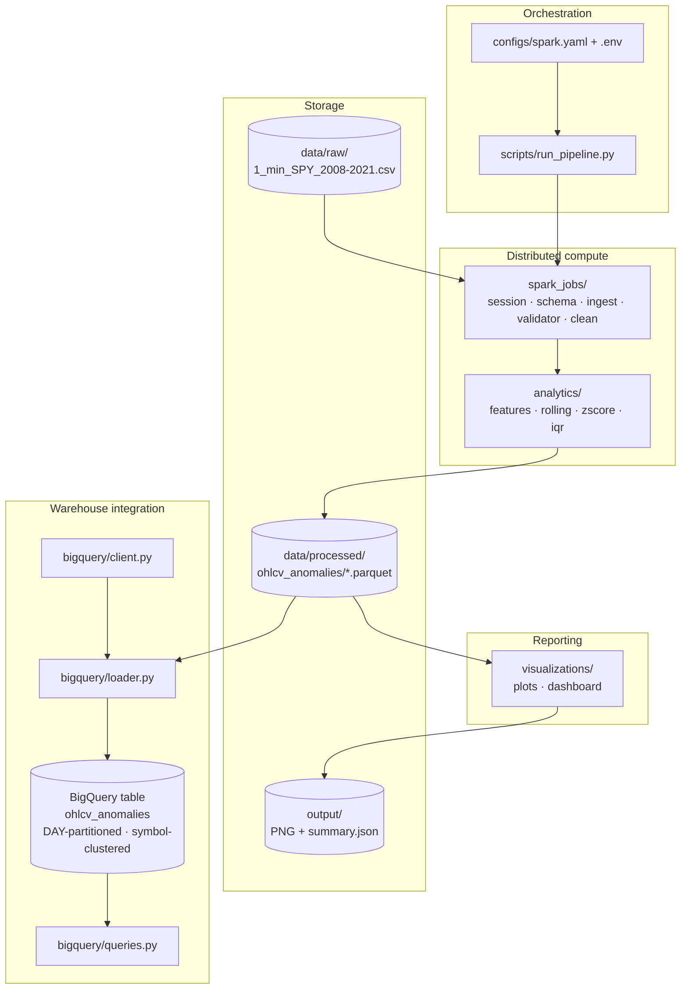

# Financial Market Anomaly Detection Pipeline

A batch data engineering pipeline that ingests intraday equity bars, engineers features and rolling statistics at scale with PySpark, flags anomalous bars via rolling z-score and IQR detectors, persists results to Google BigQuery with cost-aware storage layout, and renders an analytical dashboard directly from the processed dataset.

## Project Overview

**Problem.** Intraday equity data arrives at minute resolution and, at multi-year multi-symbol scope, grows into hundreds of millions of rows. Analysts need to isolate statistically unusual bars — sharp deviations from local mean, extreme volume, break-outs of the price envelope — without pre-committing to a single algorithm and without waiting on ad-hoc notebook runs. The traditional pandas approach either fits in memory but doesn't scale, or scales but abandons the ergonomic APIs the team already knows.

**Why distributed processing.** The reference dataset is 1-minute SPY bars from 2008 through 2021 — approximately 2.07 million rows. A single-symbol slice fits in memory, but the pipeline is written so the same code path handles the multi-symbol, multi-year expansions the roadmap allows (see the architecture ADRs under `docs/`). PySpark provides distributed CSV ingestion with an explicit schema, native window functions for rolling statistics without hand-rolled group-by loops, and Parquet output that BigQuery can load directly.

**What the pipeline accomplishes.** A single command reads the raw CSV, enforces a strict schema at the ingest boundary, cleans and sorts the series, computes three deterministic features (simple return, price range, candle body), maintains a 20-bar trailing mean and standard deviation on the close price, flags rolling z-score anomalies at ±3σ and IQR outliers at Tukey's 1.5·IQR fence, writes the enriched dataset as Snappy-compressed Parquet, and loads it into a DAY-partitioned, symbol-clustered BigQuery table. A downstream visualization module reads that Parquet output and produces nine publication-quality PNG figures plus a JSON run summary.

## Key Features

- **Explicit schema at ingest** — PySpark reads the source CSV with a hand-declared `StructType` and `mode=FAILFAST`; malformed rows fail loudly at the boundary instead of nulling silently downstream.
- **Independent stage modules** — session, schema, ingest, validate, clean, features, rolling statistics, z-score detection, and IQR detection each live in a single module with a single public entry point. Stages compose but do not import each other transitively.
- **Deterministic cleaning DAG** — dedupe, timestamp parsing, null OHLCV drop, and time sort execute as a single fluent Spark plan; no side effects, no intermediate materializations.
- **Trailing-window statistics with no lookahead** — rolling mean and rolling sample standard deviation over configurable window size, computed with Spark window functions ordered by time.
- **Two complementary anomaly detectors** — a rolling-window z-score detector for local shocks and a global IQR detector for distribution-wide outliers. Threshold and fence coefficient are call-site parameters.
- **Cost-aware BigQuery load** — DAY partitioning on `date` and clustering on `symbol` are applied by the loader on first load; append and overwrite modes share the same call.
- **SQL query library** — five parameterized analytical queries (average daily return, highest volatility symbols, top anomaly days, daily trading volume, rolling anomaly counts) returned as reusable SQL strings.
- **Independent visualization layer** — reads the processed Parquet dataset once and produces nine PNG plots plus a `dashboard_summary.json` capturing timestamp, row count, generated files, and execution time.
- **Configuration as data** — Spark tunables live in `configs/spark.yaml`; BigQuery credentials and project references live in `.env`. Job code changes only when logic changes.

## High-Level Architecture



## End-to-End Pipeline

```mermaid
flowchart LR
    A["Raw CSV<br/>data/raw/1_min_SPY_2008-2021.csv"] --> B["Spark session<br/>spark_jobs/session.py"]
    B --> C["Ingest with FAILFAST schema<br/>spark_jobs/ingest.py"]
    C --> D["Validate schema · columns<br/>non-empty · numeric types<br/>spark_jobs/validator.py"]
    D --> E["Clean<br/>dedupe → parse timestamp →<br/>drop null OHLCV → sort<br/>spark_jobs/clean.py"]
    E --> F["Features<br/>simple_return · price_range · candle_body<br/>analytics/features.py"]
    F --> G["Rolling stats (window=20)<br/>close_rolling_mean_20<br/>close_rolling_std_20<br/>analytics/rolling.py"]
    G --> H["Z-score detector (±3σ)<br/>close_zscore_20<br/>close_zscore_anomaly_20<br/>analytics/zscore.py"]
    H --> I["IQR detector (k=1.5)<br/>close_iqr_anomaly<br/>analytics/iqr.py"]
    I --> J["Attach symbol · Write Parquet<br/>data/processed/ohlcv_anomalies/"]
    J --> K["Materialize pandas at edge<br/>pd.read_parquet"]
    K --> L["Load BigQuery<br/>DAY partition on date<br/>cluster on symbol<br/>bigquery/loader.py"]
    J --> M["Dashboard<br/>9 PNGs + dashboard_summary.json<br/>visualizations/dashboard.py"]
```



## Technology Stack

**Python 3.14.** Chosen for the newest ergonomic type-hint syntax (`X | None`, `list[str]` at runtime), match-case, and the release cadence PySpark 4.x already targets. All modules use type hints on every public signature.

**PySpark 4.1 on JDK 17.** Spark is the core batch engine. The reference dataset fits in memory today, but the pipeline is written so the same code scales to multi-symbol, multi-year expansions by pointing the Spark master URL at a cluster — no logic rewrite. JDK 17 is required: Spark 4.x transitively calls `Subject.getSubject(AccessControlContext)`, which was removed in JDK 24; JDK 17 is the current LTS with which Spark 4.x is tested.

**pandas + PyArrow.** Used at the pipeline edge only. Spark writes Snappy-compressed Parquet; pandas re-reads it via PyArrow when the BigQuery loader needs a DataFrame. This avoids invoking `spark_df.toPandas()`, which would re-execute the whole Spark DAG. PyArrow is also the Parquet engine for both writes and reads.

**google-cloud-bigquery.** Official Python SDK for BigQuery. Chosen over the Spark BigQuery connector because loading pandas DataFrames via `load_table_from_dataframe` keeps the warehouse module JVM-free — no connector JAR, no `spark.jars.packages` wiring, no version pinning between Spark and BigQuery. Application Default Credentials via `GOOGLE_APPLICATION_CREDENTIALS` handle authentication.

**matplotlib + seaborn.** Static PNG output is a hard requirement for the reporting stage — the pipeline runs headless and the dashboard needs to be diffable and archivable. Seaborn provides the `whitegrid` theme and the heatmap primitive; matplotlib provides everything else. Both are stable, dependency-light, and render identically across machines.

**PyYAML.** Loads `configs/spark.yaml`. YAML picked over TOML for comment support and human editability; over JSON for the same reason. Configuration is treated as immutable data — job code reads it once at startup.

**python-dotenv.** Loads `.env` into the process environment. Chosen because it is trivially small, has no runtime cost, and matches the deploy model (a `.env` file at the project root, `.gitignore`d, sourced by the loader).

**Homebrew `openjdk@17`.** The JDK 17 build actually used to run PySpark 4.1 on macOS. Installed via Homebrew because it is keg-only and does not disturb the system default JVM; `JAVA_HOME` is set for the pipeline invocation only.

## Repository Structure

```
.
├── spark_jobs/            # Distributed transforms; one module per stage
│   ├── session.py         # SparkSession factory driven by configs/spark.yaml
│   ├── schema.py          # OHLCV_SCHEMA — source of truth for ingest types
│   ├── ingest.py          # FAILFAST CSV reader with explicit schema
│   ├── validator.py       # Five independent validate_* checks
│   └── clean.py           # dedupe → parse timestamp → drop null OHLCV → sort
├── analytics/             # Feature engineering + statistical detectors
│   ├── features.py        # simple_return, price_range, candle_body
│   ├── rolling.py         # Trailing rolling mean and std over a Spark window
│   ├── zscore.py          # Rolling z-score anomaly detector
│   └── iqr.py             # Global IQR anomaly detector via approxQuantile
├── bigquery/              # Warehouse integration
│   ├── client.py          # BigQuery client factory with .env validation
│   ├── loader.py          # Partition + cluster-aware load_dataframe
│   └── queries.py         # Five reusable analytical SQL builders
├── visualizations/        # Reporting layer, independent of upstream
│   ├── plots.py           # Nine PNG plot functions with shared style
│   └── dashboard.py       # Orchestrator: reads Parquet once, writes summary
├── scripts/               # Executable entry points
│   ├── run_pipeline.py    # End-to-end orchestration
│   └── test_spark.py      # Spark smoke test
├── configs/               # Runtime configuration
│   └── spark.yaml         # Spark session and SQL tunables
├── data/
│   ├── raw/               # Source CSV (gitignored)
│   ├── processed/         # Parquet lake (gitignored)
│   └── sample/            # Small development samples
├── output/                # Dashboard PNGs and summary JSON (gitignored)
├── logs/                  # Pipeline run logs (gitignored)
├── notebooks/             # Jupyter notebooks for exploration
├── docs/                  # Architecture, data flow, ADRs, tech stack
├── tests/                 # Test suite
├── .env                   # BIGQUERY_PROJECT, BIGQUERY_DATASET, credentials path (gitignored)
├── requirements.txt       # Pinned dependencies
└── CLAUDE.md              # Cross-module contracts and conventions
```

## Quick Start

### Installation

```bash
git clone https://github.com/nishantkr0904/financial-market-anomaly-detection-pipeline.git
cd financial-market-anomaly-detection-pipeline

python3.14 -m venv .venv
source .venv/bin/activate
pip install -r requirements.txt
```

JDK 17 is required for PySpark 4.1. On macOS:

```bash
brew install openjdk@17
```

Later JDKs (24+) are not compatible with Spark 4.x — the pipeline will not run on the system default JVM if it is newer than 17.

### Environment setup

Create a `.env` file at the repository root (it is gitignored):

```
BIGQUERY_PROJECT=your-gcp-project-id
BIGQUERY_DATASET=your_dataset
GOOGLE_APPLICATION_CREDENTIALS=/absolute/path/to/service-account.json
```

The service account must have `bigquery.dataEditor` on the target dataset, or an equivalent custom role. Place the raw CSV at `data/raw/1_min_SPY_2008-2021.csv`.

### Running the pipeline

```bash
export JAVA_HOME=/opt/homebrew/opt/openjdk@17
export PATH="$JAVA_HOME/bin:$PATH"

PYTHONPATH=. python scripts/run_pipeline.py
```

The script runs every stage end-to-end: Spark session → CSV ingest → validation → cleaning → features → rolling statistics → z-score detection → IQR detection → Parquet write to `data/processed/ohlcv_anomalies/` → pandas materialization at the edge → BigQuery load into the `ohlcv_anomalies` table. Progress is logged to stdout and captured under `logs/`.

### Running the dashboard

The dashboard is independent of the pipeline driver and reads the processed Parquet dataset directly:

```bash
PYTHONPATH=. python -m visualizations.dashboard
```

Output lands in `output/`: nine PNG figures (price trend, rolling z-score, rolling statistics, IQR distribution, volume distribution, correlation heatmap, daily anomaly frequency, monthly anomaly frequency, top anomaly days) plus a `dashboard_summary.json` capturing the generation timestamp, processed row count, generated file names, and execution time.

## Current Project Status

The full Spark pipeline (ingest → validate → clean → features → rolling statistics → z-score detection → IQR detection → Parquet) is implemented and runs end-to-end against the reference dataset. The processed output contains 2,070,834 enriched rows persisted as Snappy-compressed Parquet.

The BigQuery integration is production-oriented: the loader configures DAY partitioning on `date` and clustering on `symbol` via `LoadJobConfig`, opts out of partition expiration by default (correct for historical research data), and exposes append and overwrite modes through a single call. The reusable SQL library in `bigquery/queries.py` targets that storage layout — every query filters on the partition key and predicates the cluster key. This implementation is designed for a billing-enabled Google Cloud project; a BigQuery Sandbox was used for demonstration during development.

The visualization layer is complete. `visualizations/dashboard.py` reads the processed Parquet dataset exactly once, validates that every column the plotting functions consume is present, and produces the nine PNG figures plus `output/dashboard_summary.json` in a single invocation.
