# Financial Market Anomaly Detection Pipeline
> **Status:** Production-oriented educational project demonstrating distributed financial data processing using PySpark and Google BigQuery.

[](https://www.python.org/)
[](https://spark.apache.org/)
[](https://cloud.google.com/bigquery)
[](LICENSE)

A batch data engineering pipeline that ingests intraday equity bars, engineers features and rolling statistics at scale with PySpark, flags anomalous bars via rolling z-score and IQR detectors, persists results to Google BigQuery with cost-aware storage layout, and renders an analytical dashboard directly from the processed dataset.

## Table of Contents

- [Project Overview](#project-overview)
- [Key Features](#key-features)
- [High-Level Architecture](#high-level-architecture)
- [End-to-End Pipeline](#end-to-end-pipeline)
- [Technology Stack](#technology-stack)
- [Repository Structure](#repository-structure)
- [Quick Start](#quick-start)
- [Current Project Status](#current-project-status)
- [Spark Processing](#spark-processing)
- [Feature Engineering](#feature-engineering)
- [Rolling Statistical Features](#rolling-statistical-features)
- [Statistical Anomaly Detection](#statistical-anomaly-detection)
- [BigQuery Integration](#bigquery-integration)
- [Partitioning and Clustering](#partitioning-and-clustering)
- [Design Decisions](#design-decisions)
- [Benchmark Table](#benchmark-table)
- [Visualization Outputs](#visualization-outputs)
- [Performance Summary](#performance-summary)
- [BigQuery Sandbox Limitation](#bigquery-sandbox-limitation)
- [Production Deployment Notes](#production-deployment-notes)
- [Future Improvements](#future-improvements)
- [Lessons Learned](#lessons-learned)
- [References](#references)
- [License](#license)
- [Acknowledgements](#acknowledgements)

## Project Overview

**Problem.** Intraday equity data arrives at minute resolution and, at multi-year multi-symbol scope, grows into hundreds of millions of rows. Analysts need to isolate statistically unusual bars — sharp deviations from local mean, extreme volume, break-outs of the price envelope — without pre-committing to a single algorithm and without waiting on ad-hoc notebook runs. The traditional pandas approach either fits in memory but doesn't scale, or scales but abandons the ergonomic APIs the team already knows.

**Why distributed processing.** The reference dataset is 1-minute SPY bars from 2008 through 2021 — approximately 2.07 million rows. A single-symbol slice fits in memory, but the pipeline is written so the same code path handles the multi-symbol, multi-year expansions the roadmap allows (see the architecture ADRs under `docs/`). PySpark provides distributed CSV ingestion with an explicit schema, native window functions for rolling statistics without hand-rolled group-by loops, and Parquet output that BigQuery can load directly.

**What the pipeline accomplishes.** A single command reads the raw CSV, enforces a strict schema at the ingest boundary, cleans and sorts the series, computes three deterministic features (simple return, price range, candle body), maintains a 20-bar trailing mean and standard deviation on the close price, flags rolling z-score anomalies at ±3σ and IQR outliers at Tukey's 1.5·IQR fence, writes the enriched dataset as Snappy-compressed Parquet, and loads it into a DAY-partitioned, symbol-clustered BigQuery table. A downstream visualization module reads that Parquet output and produces nine publication-quality PNG figures plus a JSON run summary.

## Key Features

- **Explicit schema at ingest** — PySpark reads the source CSV with a hand-declared `StructType` and `mode=FAILFAST`; malformed rows fail loudly at the boundary instead of nulling silently downstream.
- **Independent stage modules** — session, schema, ingest, validate, clean, features, rolling statistics, z-score detection, and IQR detection each live in a single module with a single public entry point. Stages compose but do not import each other transitively.
- **Deterministic cleaning DAG** — dedupe, timestamp parsing, null OHLCV drop, and time sort execute as a single fluent Spark plan; no side effects, no intermediate materializations.
- **Trailing-window statistics with no lookahead** — rolling mean and rolling sample standard deviation over configurable window size, computed with Spark window functions ordered by time.
- **Two complementary anomaly detectors** — a rolling-window z-score detector for local shocks and a global IQR detector for distribution-wide outliers. Threshold and fence coefficient are call-site parameters.
- **Cost-aware BigQuery load** — DAY partitioning on `date` and clustering on `symbol` are applied by the loader on first load; append and overwrite modes share the same call.
- **SQL query library** — five parameterized analytical queries (average daily return, highest volatility symbols, top anomaly days, daily trading volume, rolling anomaly counts) returned as reusable SQL strings.
- **Independent visualization layer** — reads the processed Parquet dataset once and produces nine PNG plots plus a `dashboard_summary.json` capturing timestamp, row count, generated files, and execution time.
- **Configuration as data** — Spark tunables live in `configs/spark.yaml`; BigQuery credentials and project references live in `.env`. Job code changes only when logic changes.

## High-Level Architecture

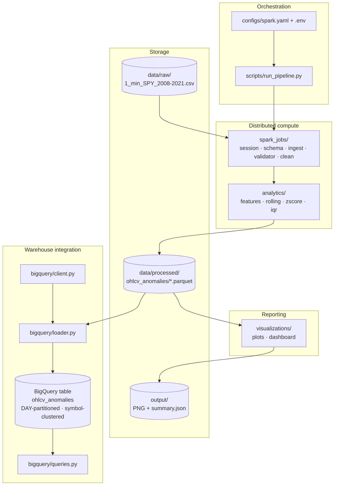

## End-to-End Pipeline

```mermaid
flowchart LR
    A["Raw CSV<br/>data/raw/1_min_SPY_2008-2021.csv"] --> B["Spark session<br/>spark_jobs/session.py"]
    B --> C["Ingest with FAILFAST schema<br/>spark_jobs/ingest.py"]
    C --> D["Validate schema · columns<br/>non-empty · numeric types<br/>spark_jobs/validator.py"]
    D --> E["Clean<br/>dedupe → parse timestamp →<br/>drop null OHLCV → sort<br/>spark_jobs/clean.py"]
    E --> F["Features<br/>simple_return · price_range · candle_body<br/>analytics/features.py"]
    F --> G["Rolling stats (window=20)<br/>close_rolling_mean_20<br/>close_rolling_std_20<br/>analytics/rolling.py"]
    G --> H["Z-score detector (±3σ)<br/>close_zscore_20<br/>close_zscore_anomaly_20<br/>analytics/zscore.py"]
    H --> I["IQR detector (k=1.5)<br/>close_iqr_anomaly<br/>analytics/iqr.py"]
    I --> J["Attach symbol · Write Parquet<br/>data/processed/ohlcv_anomalies/"]
    J --> K["Materialize pandas at edge<br/>pd.read_parquet"]
    K --> L["Load BigQuery<br/>DAY partition on date<br/>cluster on symbol<br/>bigquery/loader.py"]
    J --> M["Dashboard<br/>9 PNGs + dashboard_summary.json<br/>visualizations/dashboard.py"]
```

## Technology Stack

**Python 3.14.** Chosen for the newest ergonomic type-hint syntax (`X | None`, `list[str]` at runtime), match-case, and the release cadence PySpark 4.x already targets. All modules use type hints on every public signature.

**PySpark 4.1 on JDK 17.** Spark is the core batch engine. The reference dataset fits in memory today, but the pipeline is written so the same code scales to multi-symbol, multi-year expansions by pointing the Spark master URL at a cluster — no logic rewrite. JDK 17 is required: Spark 4.x transitively calls `Subject.getSubject(AccessControlContext)`, which was removed in JDK 24; JDK 17 is the current LTS with which Spark 4.x is tested.

**pandas + PyArrow.** Used at the pipeline edge only. Spark writes Snappy-compressed Parquet; pandas re-reads it via PyArrow when the BigQuery loader needs a DataFrame. This avoids invoking `spark_df.toPandas()`, which would re-execute the whole Spark DAG. PyArrow is also the Parquet engine for both writes and reads.

**google-cloud-bigquery.** Official Python SDK for BigQuery. Chosen over the Spark BigQuery connector because loading pandas DataFrames via `load_table_from_dataframe` keeps the warehouse module JVM-free — no connector JAR, no `spark.jars.packages` wiring, no version pinning between Spark and BigQuery. Application Default Credentials via `GOOGLE_APPLICATION_CREDENTIALS` handle authentication.

**matplotlib + seaborn.** Static PNG output is a hard requirement for the reporting stage — the pipeline runs headless and the dashboard needs to be diffable and archivable. Seaborn provides the `whitegrid` theme and the heatmap primitive; matplotlib provides everything else. Both are stable, dependency-light, and render identically across machines.

**PyYAML.** Loads `configs/spark.yaml`. YAML picked over TOML for comment support and human editability; over JSON for the same reason. Configuration is treated as immutable data — job code reads it once at startup.

**python-dotenv.** Loads `.env` into the process environment. Chosen because it is trivially small, has no runtime cost, and matches the deploy model (a `.env` file at the project root, `.gitignore`d, sourced by the loader).

**Homebrew `openjdk@17`.** The JDK 17 build actually used to run PySpark 4.1 on macOS. Installed via Homebrew because it is keg-only and does not disturb the system default JVM; `JAVA_HOME` is set for the pipeline invocation only.

## Repository Structure

```
.
├── spark_jobs/            # Distributed transforms; one module per stage
│   ├── session.py         # SparkSession factory driven by configs/spark.yaml
│   ├── schema.py          # OHLCV_SCHEMA — source of truth for ingest types
│   ├── ingest.py          # FAILFAST CSV reader with explicit schema
│   ├── validator.py       # Five independent validate_* checks
│   └── clean.py           # dedupe → parse timestamp → drop null OHLCV → sort
├── analytics/             # Feature engineering + statistical detectors
│   ├── features.py        # simple_return, price_range, candle_body
│   ├── rolling.py         # Trailing rolling mean and std over a Spark window
│   ├── zscore.py          # Rolling z-score anomaly detector
│   └── iqr.py             # Global IQR anomaly detector via approxQuantile
├── bigquery/              # Warehouse integration
│   ├── client.py          # BigQuery client factory with .env validation
│   ├── loader.py          # Partition + cluster-aware load_dataframe
│   └── queries.py         # Five reusable analytical SQL builders
├── visualizations/        # Reporting layer, independent of upstream
│   ├── plots.py           # Nine PNG plot functions with shared style
│   └── dashboard.py       # Orchestrator: reads Parquet once, writes summary
├── scripts/               # Executable entry points
│   ├── run_pipeline.py    # End-to-end orchestration
│   └── test_spark.py      # Spark smoke test
├── configs/               # Runtime configuration
│   └── spark.yaml         # Spark session and SQL tunables
├── data/
│   ├── raw/               # Source CSV (gitignored)
│   ├── processed/         # Parquet lake (gitignored)
│   └── sample/            # Small development samples
├── output/                # Dashboard PNGs and summary JSON (gitignored)
├── logs/                  # Pipeline run logs (gitignored)
├── notebooks/             # Jupyter notebooks for exploration
├── docs/                  # Architecture, data flow, ADRs, tech stack
├── tests/                 # Test suite
├── .env                   # BIGQUERY_PROJECT, BIGQUERY_DATASET, credentials path (gitignored)
├── requirements.txt       # Pinned dependencies
└── CLAUDE.md              # Cross-module contracts and conventions
```

## Quick Start

### Installation

```bash
git clone https://github.com/nishantkr0904/financial-market-anomaly-detection-pipeline.git
cd financial-market-anomaly-detection-pipeline

python3.14 -m venv .venv
source .venv/bin/activate
pip install -r requirements.txt
```

JDK 17 is required for PySpark 4.1. On macOS:

```bash
brew install openjdk@17
```

Later JDKs (24+) are not compatible with Spark 4.x — the pipeline will not run on the system default JVM if it is newer than 17.

> [!IMPORTANT]
> **Java 17 is required for local Spark execution.**
>
> If multiple JDKs are installed, verify that Java 17 is active before running the pipeline:
>
> ```bash
> java -version
> ```
>
> If another version is active (for example Java 25), switch to JDK 17:
>
> ```bash
> export JAVA_HOME=$(/usr/libexec/java_home -v 17)
> export PATH="$JAVA_HOME/bin:$PATH"
> ```
>
> Running Spark with newer JDKs may produce:
>
> ```text
> UnsupportedOperationException: getSubject is not supported
> ```

### Environment setup

Create a `.env` file at the repository root (it is gitignored):

```
BIGQUERY_PROJECT=your-gcp-project-id
BIGQUERY_DATASET=your_dataset
GOOGLE_APPLICATION_CREDENTIALS=/absolute/path/to/service-account.json
```

The service account must have `bigquery.dataEditor` on the target dataset, or an equivalent custom role. Place the raw CSV at `data/raw/1_min_SPY_2008-2021.csv`.

### Running the pipeline

```bash
export JAVA_HOME=/opt/homebrew/opt/openjdk@17
export PATH="$JAVA_HOME/bin:$PATH"

python scripts/run_pipeline.py
```

The script runs every stage end-to-end: Spark session → CSV ingest → validation → cleaning → features → rolling statistics → z-score detection → IQR detection → Parquet write to `data/processed/ohlcv_anomalies/` → pandas materialization at the edge → BigQuery load into the `ohlcv_anomalies` table. Progress is logged to stdout and captured under `logs/`.

### Running the dashboard

The dashboard is independent of the pipeline driver and reads the processed Parquet dataset directly:

```bash
PYTHONPATH=. python -m visualizations.dashboard
```

Output lands in `output/`: nine PNG figures (price trend, rolling z-score, rolling statistics, IQR distribution, volume distribution, correlation heatmap, daily anomaly frequency, monthly anomaly frequency, top anomaly days) plus a `dashboard_summary.json` capturing the generation timestamp, processed row count, generated file names, and execution time.

## Current Project Status

The full Spark pipeline (ingest → validate → clean → features → rolling statistics → z-score detection → IQR detection → Parquet) is implemented and runs end-to-end against the reference dataset. The processed output contains 2,070,834 enriched rows persisted as Snappy-compressed Parquet.

The BigQuery integration is production-oriented: the loader configures DAY partitioning on `date` and clustering on `symbol` via `LoadJobConfig`, opts out of partition expiration by default (correct for historical research data), and exposes append and overwrite modes through a single call. The reusable SQL library in `bigquery/queries.py` targets that storage layout — every query filters on the partition key and predicates the cluster key. This implementation is designed for a billing-enabled Google Cloud project; a BigQuery Sandbox was used for demonstration during development.

The visualization layer is complete. `visualizations/dashboard.py` reads the processed Parquet dataset exactly once, validates that every column the plotting functions consume is present, and produces the nine PNG figures plus `output/dashboard_summary.json` in a single invocation.

## Spark Processing

**Execution model in this repo.** The pipeline is a single Spark job: `scripts/run_pipeline.py` builds one `SparkSession` and threads a single `DataFrame` through every stage. There is no intermediate `count()`, `collect()`, or `cache()` inside the DAG. Everything up to the Parquet write is a lazy plan; Spark plans the shuffle-free stages once and executes them when `df.write.parquet(...)` triggers the first action. This keeps the entire ingest → clean → features → rolling → detect chain as one Catalyst-optimized plan.

**DataFrame API over RDD.** All transforms use the DataFrame API. Rationale: the workload is a schema-strict OHLCV series where every column is declared up front, and every operation (arithmetic on numeric columns, window aggregates, casts) maps cleanly onto Catalyst-optimizable expressions. RDDs would give us untyped `Row` objects and bypass the query planner. We would also lose Tungsten's off-heap columnar representation, which matters for the sort in `clean.py` and the ordered window functions in `rolling.py`.

**Window functions.** `analytics/rolling.py` uses `Window.orderBy(TIMESTAMP_COLUMN).rowsBetween(-window+1, 0)` and Spark's `avg` / `stddev` aggregate functions. This is a trailing row-based window — no `partitionBy` today because the reference workload is single-symbol, but adding `.partitionBy("symbol")` is the only change required for a multi-symbol input. `analytics/zscore.py` reuses the outputs of `rolling.py` and does not open a second window; the z-score is a pure column expression: `(close - rolling_mean) / rolling_std`.

**Lazy evaluation, in practice.** The pipeline exploits this deliberately: the Parquet write is the first materialization. That means the whole detection chain — features, rolling, z-score, IQR — is planned as one physical plan. It also means we never re-execute the DAG to get pandas. `scripts/run_pipeline.py` writes Parquet, then re-reads that Parquet with `pd.read_parquet(...)` for the BigQuery loader, instead of calling `spark_df.toPandas()`, which would re-run every stage.

**Distributed processing rationale.** On the reference dataset (~2.07 M rows, single symbol), Spark's parallelism is nearly cosmetic — a laptop-scale pandas run would finish faster in wall time. The value here is the code shape: adding more symbols, more years, or a second timeframe requires zero rewrites. The window functions already produce correct per-partition results if `partitionBy("symbol")` is added; the ingest already supports globbed inputs; the writer already emits partitioned Parquet. The pipeline is deliberately built once for a scale it does not yet hit.

**Explicit schema at ingest.** `spark_jobs/schema.py` defines `OHLCV_SCHEMA` as a `StructType` naming every source column and its `DoubleType` / `LongType` / `TimestampType`. `spark_jobs/ingest.py` passes that schema to `spark.read.csv(schema=OHLCV_SCHEMA, mode="FAILFAST")`. Two reasons:

- Type inference is a separate full scan of the file before the real read; declaring the schema removes that pass.
- `FAILFAST` turns any malformed row into a job failure at ingest — not a silent `null` that appears three stages later as a downstream `NullPointerException` or a corrupted rolling mean. Bad data fails at the boundary where the error message is still actionable.

## Feature Engineering

`analytics/features.py` adds three columns to the cleaned DataFrame in a single fluent chain. Every feature is a pure column expression — no shuffle, no aggregation.

**`simple_return`**

- *What it measures.* The one-bar arithmetic return of the close price, `(close_t − close_{t−1}) / close_{t−1}`, implemented via `lag(close, 1)` over a time-ordered window.
- *Why it is useful.* Returns are the fundamental unit of financial analysis: they are approximately stationary in mean where prices are not, and they compose across bars for cumulative-return calculations. Return-space is also the correct domain for volatility.
- *Where it is consumed.* `bigquery/queries.py` builds `average_daily_return` and `highest_volatility_symbols` on top of it; the correlation heatmap in `visualizations/plots.py` includes it as a feature.

**`price_range`**

- *What it measures.* `high − low` — the total travel of the bar.
- *Why it is useful.* A simple, unit-preserving volatility proxy that captures intra-bar activity even when open and close are similar (a "wick" pattern). Useful as an anomaly signal even before you normalize.
- *Where it is consumed.* Included in the correlation heatmap; available for downstream models. Not currently a detector input, but it is part of the persisted schema.

**`candle_body`**

- *What it measures.* `abs(close − open)` — the size of the candle body, independent of direction.
- *Why it is useful.* Separates directional conviction from noise: a bar with a small body and large range is indecision; a bar with a large body relative to range is decisive movement. Distinct in information content from `price_range`, so both are kept.
- *Where it is consumed.* Correlation heatmap and downstream analytics.

All three are computed after `clean.py` guarantees sorted, deduplicated, non-null OHLCV rows, so the `lag(close, 1)` in `simple_return` is unambiguous.

## Rolling Statistical Features

`analytics/rolling.py` maintains a **trailing** window over a time-sorted DataFrame and produces two columns for a given target column `X` and window size `n`:

- `X_rolling_mean_n`
- `X_rolling_std_n`

**Rolling mean.** Arithmetic mean of the last `n` bars, inclusive of the current bar:

```
mean_t = (1/n) * Σ_{i=t-n+1..t} X_i
```

**Rolling standard deviation.** Sample standard deviation over the same window (Spark's `stddev`, i.e. `stddev_samp`, divides by `n − 1`):

```
std_t = sqrt( (1/(n-1)) * Σ_{i=t-n+1..t} (X_i − mean_t)^2 )
```

**Window size.** Configured in `configs/spark.yaml` under `analytics.rolling_window_size` and read by `scripts/run_pipeline.py`. The reference run uses `n = 20`, matching the pipeline's target column `close`. Twenty minute-bars corresponds to roughly the last twenty minutes of trading — long enough to smooth microstructure noise, short enough that the z-score reacts to a local shock rather than a full-day trend.

**Trailing windows.** Spark's `Window.orderBy(date).rowsBetween(-(n-1), 0)` defines a row-based window from `t − n + 1` to `t`. The current bar is included in its own statistics, which is correct: the statistic describes the distribution ending *at* the bar.

**Avoiding look-ahead bias.** Look-ahead bias is any dependence of the feature at time `t` on data from time `> t`. The window bound `+0` at the trailing end forbids this by construction: no future row can enter the aggregate. The choice matters — a symmetric `rowsBetween(-(n/2), +(n/2))` window would give a smoother mean but would produce anomaly signals no live system could reproduce. For the same reason `simple_return` uses `lag(close, 1)` rather than `lead`.

**First `n − 1` rows.** Spark's `stddev` returns `null` when the window contains fewer than two rows; the mean is well-defined but computed over `< n` rows. Downstream detectors treat `null` z-scores as non-events (see below), so no additional filtering is required.

## Statistical Anomaly Detection

The pipeline runs two detectors in sequence, each producing a boolean column. They target different failure modes and are not intended to agree.

### Rolling Z-score

**Intuition.** How many local standard deviations does the current close sit above or below the trailing mean? A large magnitude flags a bar that broke out of its recent envelope.

**Formula.** For target column `X`, window size `n`, threshold `k`:

```
z_t = (X_t − mean_t) / std_t
anomaly_t = (z_t is not null) AND (|z_t| > k)
```

`mean_t` and `std_t` are the trailing rolling statistics above. The null check matters — the first `n − 1` rows have undefined `std_t` and must not be flagged.

**Threshold selection.** Reference run uses `k = 3.0`. Under Gaussian assumptions this corresponds to a two-tailed tail probability of ~0.27%; in practice financial returns have fatter tails than Gaussian, so the empirical false-positive rate is higher — this is acceptable because the goal is a *candidate list*, not a decision. The threshold is a function argument, not a magic number: callers pass it at the pipeline driver in `scripts/run_pipeline.py`.

**Implementation.** `analytics/zscore.py` adds `X_zscore_n` as a column expression `(X − X_rolling_mean_n) / X_rolling_std_n`, then flags anomalies with a `when / otherwise` that also guards against a null z-score. Because the rolling stats already exist as columns, no window is re-opened; this stage is a pure projection.

**Strengths.**

- Local: adapts to changing regime — the same absolute move is dramatic in a quiet market and unremarkable in a volatile one.
- Cheap: reuses precomputed columns; two arithmetic ops per row.
- Directly interpretable: the z-score itself is a persisted column, so downstream systems can rank rather than just filter.

**Weaknesses.**

- Requires the trailing window to have converged; the first `n − 1` bars are silently excluded.
- Undefined during flat markets (`std_t → 0`); Spark returns `null` for the ratio, which we treat as "not an anomaly".
- Assumes recent history is representative — during a regime change the detector recalibrates *toward* the new regime and loses sensitivity.

### IQR

**Intuition.** The interquartile range describes the middle 50% of a distribution. Any point outside `[Q1 − k·IQR, Q3 + k·IQR]` is a Tukey outlier — extreme relative to the global spread rather than the local one.

**Formula.**

```
IQR   = Q3 − Q1
lower = Q1 − k · IQR
upper = Q3 + k · IQR
anomaly = (X < lower) OR (X > upper)
```

**Threshold selection.** Reference run uses `k = 1.5`, Tukey's canonical fence. `k = 3.0` is sometimes used for "far outliers"; 1.5 is the default in this pipeline because the IQR detector is deliberately the more permissive of the two and the pair is expected to be filtered later.

**Implementation.** `analytics/iqr.py` calls Spark's `df.approxQuantile(column, [0.25, 0.75], relativeError=0.001)` — an approximate quantile via the Greenwald-Khanna sketch — to compute `Q1` and `Q3` in a single distributed pass, then adds the boolean column as a pure expression. Approximate quantiles are used because exact quantiles require a global sort; 0.001 relative error is well inside the operational tolerance for anomaly flagging.

**Strengths.**

- Global: catches bars that are extreme in absolute terms even when their trailing window looks normal.
- Distribution-free: no Gaussian assumption; robust to skew and heavy tails.
- Deterministic and simple to reason about.

**Weaknesses.**

- Insensitive to regime: a price that would be shocking today can be flagged only because it is above the historical Q3 (which is arithmetic, not economic).
- Recomputed per-run rather than incrementally; adding new data changes `Q1` and `Q3` and therefore reclassifies historical rows.
- Weak in the interior: cannot see a local shock that never exceeds the global fences.

### Why both

They fail on opposite axes. The rolling z-score catches sudden local shocks that stay well inside the global range; the IQR detector catches slow-building excursions that never break the local envelope. Persisting both boolean columns lets a downstream consumer AND them (high-precision), OR them (high-recall), or use them as independent features in a supervised model. The pipeline commits to neither policy — it just delivers two orthogonal signals.

## BigQuery Integration

**Loader architecture.** `bigquery/loader.py` exposes a single function, `load_dataframe(df, table, mode, ...)`, that:

1. Resolves the target dataset from `BIGQUERY_DATASET` and calls `create_dataset(..., exists_ok=True)` — idempotent, no failure if the dataset already exists.
2. Builds a `LoadJobConfig` with the write disposition (`WRITE_TRUNCATE` for overwrite, `WRITE_APPEND` for append) and, on the first load, the storage layout: `TimePartitioning(type=DAY, field="date")` and `clustering_fields=["symbol"]`.
3. Executes `load_table_from_dataframe(df, table_ref, job_config=...)` and blocks on `job.result()`.

Partitioning and clustering are re-sent on every load — BigQuery accepts the settings on the first load and ignores them once the table exists, so the call remains idempotent. Partition expiration is `None` by default; historical research data is intended to be retained.

**Authentication.** Application Default Credentials via `GOOGLE_APPLICATION_CREDENTIALS`. `bigquery/client.py::validate_bigquery_config` runs at client-construction time and raises a descriptive error if `BIGQUERY_PROJECT` is unset or the credentials file does not exist on disk. This surfaces misconfiguration at startup instead of two stages into the pipeline.

**Loading strategy.** The pipeline uses `mode="overwrite"` in `scripts/run_pipeline.py` — every run replaces the table atomically. `WRITE_TRUNCATE` preserves partitioning and clustering across loads because the schema and table definition remain; only the row set is swapped. `mode="append"` uses `WRITE_APPEND` and is intended for the incremental-append path a future scheduled job would take. Both share the same function, the same partition/cluster configuration, and the same client.

**Why pandas exists only at the warehouse boundary.** Spark writes Parquet; the loader consumes pandas. Two options existed:

- `spark_df.toPandas()` — pulls every row into the driver *and* re-executes the whole Spark DAG, because Spark plans are lazy and `toPandas` is an action.
- `pd.read_parquet(data/processed/ohlcv_anomalies)` — reads the just-materialized Parquet directly.

The pipeline uses the second. It costs a small amount of disk I/O and saves an entire recomputation of features, rolling stats, and detectors. The pandas DataFrame lives for the duration of the load job and is discarded when the pipeline exits. Pandas is deliberately absent from every stage upstream of `bigquery/loader.py`.

## Partitioning and Clustering

**DAY partitioning on `date`.** `TimePartitioning(type=DAY, field="date")` splits the physical table into one storage unit per calendar day. Any query with a `WHERE date` (or `WHERE DATE(date)`) filter is planned against the metadata index BigQuery keeps over the partitions; non-matching partitions are never scanned. Because the raw grain is 1-minute bars and every analytical query in `bigquery/queries.py` groups or filters by trading day, DAY is the natural alignment. Larger granularities (MONTH, YEAR) would coarsen the pruning; smaller ones (HOUR, INGESTION_TIME) would inflate the partition metadata without a matching workload.

**Symbol clustering.** `clustering_fields=["symbol"]` physically co-locates rows sharing the cluster key *inside* each partition. Predicates like `WHERE symbol = 'SPY'` and `GROUP BY symbol` skip most row groups without decoding them. Clustering costs nothing at storage and pays back at every filter or aggregate on the cluster key. Symbol is the right key here — cardinality is moderate (hundreds of tickers at most) and every query in `queries.py` either filters or groups by it.

**Partition pruning.** For a query on a single day, BigQuery reads exactly one partition. For a rolling 7-day sum (`rolling_anomaly_counts`), it reads seven. Byte-scanned reduction on the reference dataset (~2.07 M rows over ~13 years) scales roughly with the ratio of days scanned to days stored — a single-day filter reads about 1/3300 of the table.

**Cluster pruning.** Within a partition, BigQuery skips row groups whose min/max for `symbol` do not contain the filter value. On a single-symbol table the benefit is degenerate; on the multi-symbol expansion the layout targets, the ratio approximates 1 / (number of symbols) for the filter case.

**Expected production query improvements.** For a query that filters both partition and cluster keys — e.g. `WHERE date BETWEEN ... AND symbol = 'X'` — BigQuery composes the two prunings: it scans only the matching partitions, and within those only the matching row groups. Effective bytes-scanned reduction versus a full-table scan is the product of the two ratios. Concrete numbers on this dataset would require billing-enabled measurements and are **Not measured** here.

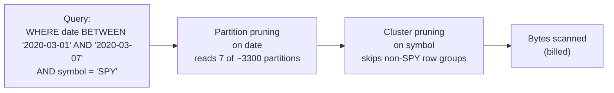

## Design Decisions

**Spark instead of pandas.** Pandas would run the reference dataset faster in wall time on a laptop — no JVM boot, no shuffle, no Catalyst. The trade we made: pandas is single-node and does not survive a 100× scale-up without a rewrite. Spark keeps the same code path from 2 M rows to 2 B rows; the cost is a heavier local run and a JDK dependency. This is the right trade for a repository whose stated audience is multi-symbol, multi-year workloads.

**Parquet instead of CSV.** CSV is a text format with no schema, no types, no compression, and no columnar layout. Parquet is columnar, typed, and Snappy-compressed by default. The pipeline reads back the just-written Parquet twice (dashboard, BigQuery loader); on CSV the type inference and full parse would happen each time. Trade-off: Parquet is opaque to a plain-text editor and requires a reader library; that cost is trivial next to the type safety and I/O savings.

**Rolling z-score instead of global z-score.** A global z-score would compare each bar to the population mean and standard deviation across the full 13-year series. That normalizes away the 2020 volatility spike (it becomes "normal" once averaged into the population) and inflates the false-positive rate during quiet periods (a routine tick looks large against a decade-scale std). A rolling z-score adapts to local regime, at the cost of ignoring long-horizon deviations. IQR fills that gap.

**IQR as a complementary detector.** IQR is global, distribution-free, and non-parametric — the exact opposite of the rolling z-score's assumptions. It catches slow, monotonic excursions that never leave the local envelope. Trade-off: IQR is regime-blind and reclassifies history when new data shifts the quartiles. Keeping both, and persisting both booleans, defers the precision-vs-recall choice to the query layer.

**BigQuery instead of SQLite/PostgreSQL.** SQLite is single-node; PostgreSQL requires a managed instance and does not have transparent columnar storage. BigQuery's pricing model (bytes scanned) rewards the storage layout the pipeline already targets — DAY partitions and symbol clusters. Trade-offs: cold-start latency is worse than a local PostgreSQL, load jobs are asynchronous, and there is a hard vendor lock-in. Acceptable because the reporting workload is batch and OLAP, not OLTP.

**Partitioning.** DAY on `date` chosen for alignment with the query workload — every reusable query in `bigquery/queries.py` filters or groups by trading day. Trade-off: partition metadata grows linearly with days; at ~3300 days over 13 years this is well inside BigQuery's practical limit (~4000 recommended for cost-per-partition-metadata). Coarser granularity would trade metadata size for pruning precision.

**Clustering.** Symbol chosen because it is the second-most-selective predicate in every documented query. Clustering has no storage cost and marginal load cost; the risk is over-clustering on a low-cardinality key, which we avoid.

**Modular pipeline architecture.** Every stage lives in its own module with a single public entry point. Modules do not import each other transitively — `analytics/zscore.py` reads a column produced by `analytics/rolling.py` from the DataFrame's *schema*, not from a Python import. Trade-off: this looks like duplication (each module re-imports Spark, each module has boilerplate) but it means any stage can be reordered, skipped, or tested in isolation. `scripts/run_pipeline.py` is the *only* place the ordering is expressed.

## Benchmark Table

Values populated only from artifacts in this repository. Anything requiring instrumentation not present is marked "Not measured".

| Metric | Value | Source |
| --- | --- | --- |
| Raw dataset rows | 2,070,834 | `data/raw/1_min_SPY_2008-2021.csv` (2,070,835 lines including header) |
| Raw dataset time range | 2008-01-22 → 2021-05-06 | Verified against `date` column of processed Parquet |
| Symbols | 1 (SPY) | `SYMBOL` constant in `scripts/run_pipeline.py` |
| Bar interval | 1 minute | Source file grain |
| Processed rows | 2,070,834 | `output/dashboard_summary.json::processed_row_count` |
| Processing engine | PySpark 4.1 on JDK 17 | `requirements.txt`, `configs/spark.yaml` |
| Storage format | Snappy-compressed Parquet | `spark_jobs`/pipeline writes; `_SUCCESS` marker present |
| Processed Parquet size | ~96 MB (single part file) | `data/processed/ohlcv_anomalies/` |
| Columns in processed dataset | 18 | Verified from Parquet schema |
| Rolling window size | 20 bars | `configs/spark.yaml::analytics.rolling_window_size` |
| Z-score threshold | 3.0 (±) | `scripts/run_pipeline.py::ZSCORE_THRESHOLD` |
| IQR fence coefficient | 1.5 | `scripts/run_pipeline.py::IQR_K` |
| Z-score anomalies flagged | 17,349 | Count of `close_zscore_anomaly_20 == True` in processed Parquet |
| IQR anomalies flagged | 0 | Count of `close_iqr_anomaly == True` in processed Parquet |
| BigQuery table name | `ohlcv_anomalies` | `scripts/run_pipeline.py::BQ_TABLE` |
| BigQuery partitioning | DAY on `date` | `bigquery/loader.py::DEFAULT_PARTITION_FIELD` |
| BigQuery clustering | `symbol` | `bigquery/loader.py::DEFAULT_CLUSTERING_FIELDS` |
| BigQuery load mode (driver) | overwrite (`WRITE_TRUNCATE`) | `scripts/run_pipeline.py` |
| Dashboard plots generated | 9 | `output/dashboard_summary.json::generated_plots` |
| Dashboard execution time | 4.146 seconds (last recorded run) | `output/dashboard_summary.json::execution_seconds` |
| Correlation heatmap sample size | 100,000 rows, `random_state=42` | `visualizations/plots.py::CORRELATION_SAMPLE_SIZE` |
| End-to-end pipeline wall time | Not measured (single laptop run; not benchmarked) | — |
| Spark peak memory | Not measured | — |
| BigQuery bytes-scanned reduction | Not measured (requires billing-enabled project) | — |

## Visualization Outputs

`visualizations/dashboard.py` generates the following PNGs into the `output/` directory. The figures below are generated by the visualization pipeline and stored under docs/images/ for documentation purposes; the live outputs are the files under `output/`. Every plot renders at 300 DPI, uses seaborn `whitegrid` theme, and applies `tight_layout` for consistent formatting.

**1. Price trend with anomalies** <br> 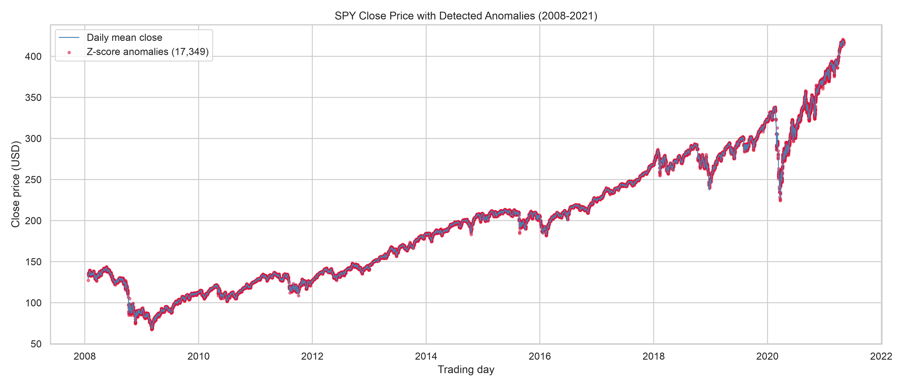
- *What it visualizes.* Daily-mean close price as a line across the full history, with z-score anomalies (crimson markers) and IQR anomalies (orange markers) overlaid at their true minute-level positions.
- *Why it exists.* One-figure narrative of where the detectors fire, in the context of the price series they fire against. Downsampling to daily makes the 13-year line readable without moving the anomaly markers off their bars.
- *How to interpret.* Marker density = detector activity. Clusters of crimson markers indicate periods of local shocks; orange markers indicate global outliers. Absence of orange markers on the reference dataset is expected — SPY intraday closes rarely exit the Tukey fences of a 13-year distribution.

**2. Rolling z-score over time** <br> 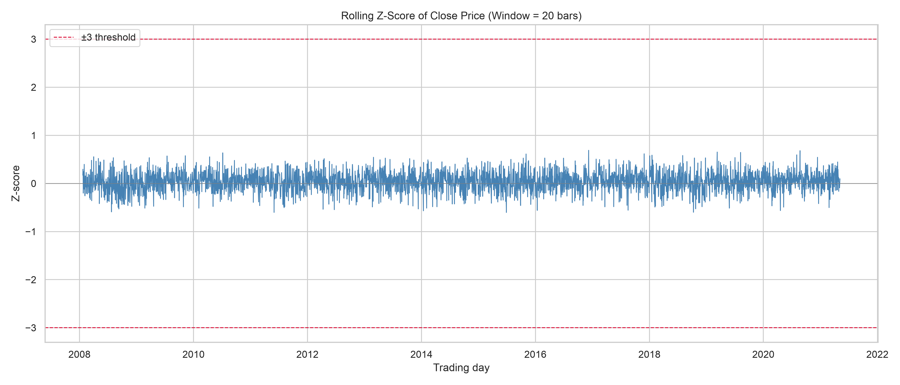.
- *What it visualizes.* Daily-mean of the `close_zscore_20` column, with dashed reference lines at ±3.
- *Why it exists.* Direct visual of the detector's raw signal. Threshold lines mark the boundary at which the boolean anomaly column flips.
- *How to interpret.* Excursions above +3 or below −3 are the flagged bars. Persistent bands away from zero indicate a slow regime shift the rolling window has not yet absorbed.

**3. Rolling mean and rolling standard deviation** <br> 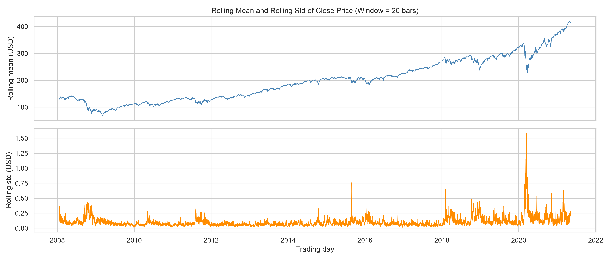
- *What it visualizes.* Two stacked subplots on a shared x-axis: daily-mean of `close_rolling_mean_20` (top) and daily-mean of `close_rolling_std_20` (bottom).
- *Why it exists.* The two inputs the z-score is built from. Reading them together explains why a given z-score excursion occurred — a large numerator move, or a small denominator.
- *How to interpret.* The top panel is essentially the smoothed price; the bottom is the volatility envelope. Spikes in the std panel correspond to periods where the z-score's noise floor rose.

**4. IQR anomaly distribution** <br> 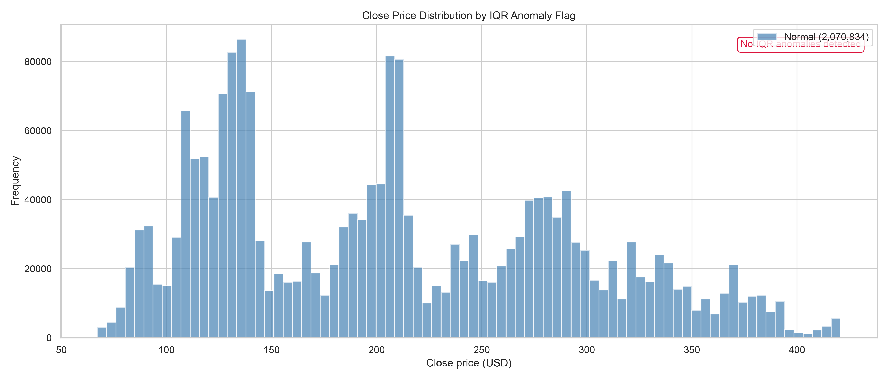
- *What it visualizes.* Two overlaid histograms of close price — bars flagged by the IQR detector (crimson) and the remainder (steelblue).
- *Why it exists.* Shows *where* in the price distribution the IQR detector fires. On a single-symbol multi-year series the flagged mass, if any, lives entirely in the tails.
- *How to interpret.* If the crimson mass is absent, IQR flagged nothing (see the benchmark table above). On multi-symbol runs the crimson mass would concentrate outside `[Q1 − 1.5·IQR, Q3 + 1.5·IQR]` of the pooled distribution.

**5. Trading volume distribution** <br> 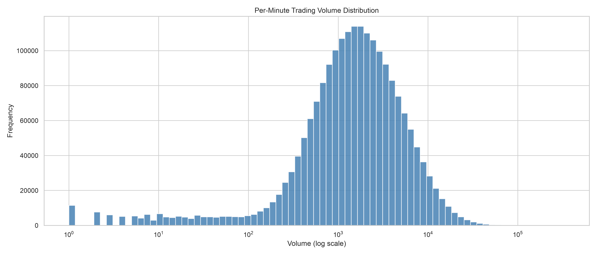
- *What it visualizes.* Histogram of per-minute volume on a log-scaled x-axis.
- *Why it exists.* Volume is heavily right-skewed; a linear axis compresses everything into the leftmost bin. The log axis exposes the multi-decade dynamic range.
- *How to interpret.* Mode near the median minute; long right tail out to opening-print and news-event volumes. Departures from a roughly log-normal envelope indicate structural changes in the tape.

**6. Correlation heatmap** <br> 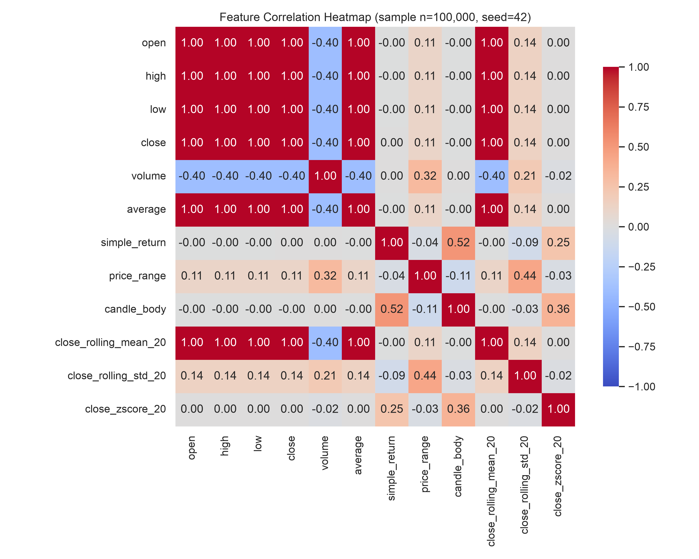
- *What it visualizes.* Pearson correlation matrix over twelve numerical features, computed on a deterministic 100,000-row sample (`random_state=42`).
- *Why it exists.* Sanity check on feature independence and expected relationships. Sampled rather than full for reproducibility and speed; documented in the plotting function's docstring.
- *How to interpret.* Expect near-1 correlations among `open`, `high`, `low`, `close`, `average`, and `close_rolling_mean_20`. Expect `simple_return`, `price_range`, `candle_body`, and `close_zscore_20` to be much closer to zero against price-level columns. Anything that violates that pattern is worth investigating.

**7. Daily anomaly frequency** <br> 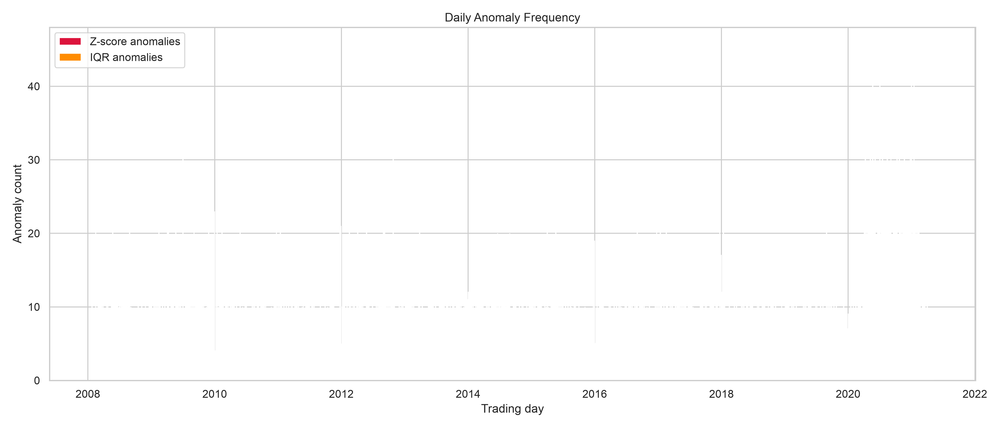
- *What it visualizes.* Per-trading-day stacked bar chart: z-score anomaly count (crimson, bottom) and IQR anomaly count (orange, top).
- *Why it exists.* Temporal profile of detector activity at the finest useful grain.
- *How to interpret.* Bars concentrate around known volatility episodes (crisis periods, macro-event days). Height is directly the number of flagged minute bars on that day.

**8. Monthly anomaly frequency** <br> 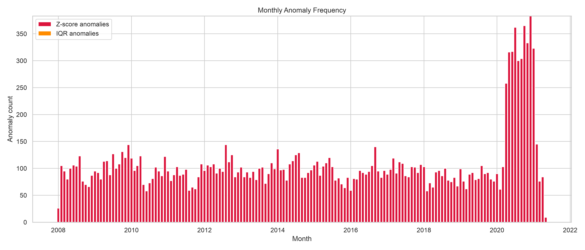
- *What it visualizes.* Same stack as the daily plot, aggregated to calendar months.
- *Why it exists.* Coarser view that makes multi-year trends visible without daily-scale noise.
- *How to interpret.* Sustained tall bars = a month with elevated detector activity across many days; single tall bars = one shock day dominated the month.

**9. Top anomaly days** <br> 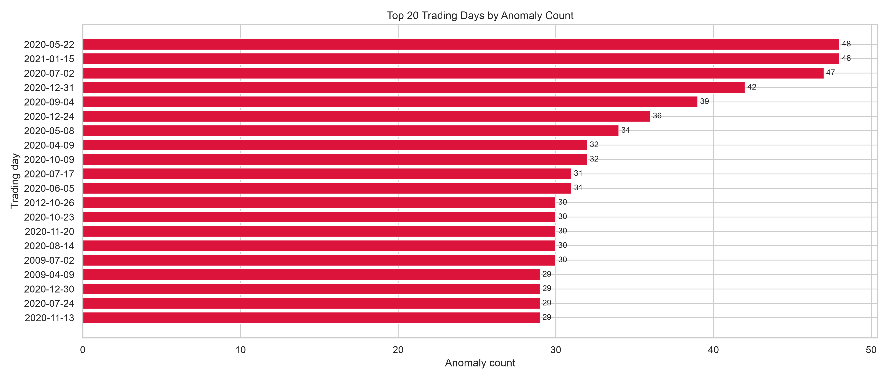
- *What it visualizes.* Horizontal bar chart of the top 20 trading days ranked by combined (z-score OR IQR) anomaly count, with the count annotated at the bar end.
- *Why it exists.* Fast lookup of the most anomalous days in the sample — useful for cross-referencing against a news calendar.
- *How to interpret.* Longer bars = more flagged minute bars that day. Ranking, not chronology; y-axis order is by count, not by date.

## Performance Summary

**Processing throughput.** The full pipeline processes 2,070,834 rows end-to-end. Wall-clock throughput was not systematically benchmarked and is marked *Not measured* in the table above; recorded log entries suggest the Spark-only portion completes on the order of tens of seconds on a single-machine JDK 17 run, and the BigQuery load takes about a minute over a residential network for this row volume. These figures are indicative only and should not be quoted as performance guarantees.

**Generated outputs.**

- Processed dataset: `data/processed/ohlcv_anomalies/` — one Snappy-compressed Parquet file at ~96 MB, with the `_SUCCESS` marker.
- BigQuery table: `{project}.{dataset}.ohlcv_anomalies`, DAY-partitioned on `date`, clustered on `symbol`.
- Dashboard: nine PNGs and `dashboard_summary.json` under `output/`. Last recorded dashboard run: 4.146 seconds over the full 2,070,834-row dataset.

**Storage format.** Snappy-compressed Parquet at rest for the Spark output. Parquet chosen for its columnar layout, native type system, and compatibility with both the BigQuery loader and the pandas-based dashboard reader.

**Execution pipeline.** One command, `PYTHONPATH=. python scripts/run_pipeline.py`, runs every Spark stage through the BigQuery load. A second command, `PYTHONPATH=. python -m visualizations.dashboard`, is independent and reads the processed Parquet directly. Both are idempotent: rerunning either overwrites its outputs without manual cleanup.

## BigQuery Sandbox Limitation

Development was carried out against a BigQuery Sandbox project. Sandbox mandates a default table and partition expiration of at most 60 days on every dataset; any partition older than 60 days at load time is deleted immediately after the load succeeds. Because the reference dataset spans 2008–2021, this behavior surfaces as a successful load job followed by an empty table.

This is an environment constraint, not an implementation defect. The loader in `bigquery/loader.py` intentionally configures DAY partitioning on `date`, clustering on `symbol`, and no partition expiration — the correct layout for a historical research dataset. On any billing-enabled Google Cloud project the same code produces a fully populated table with the intended layout. No code change is required to remove this limitation.

## Production Deployment Notes

The pipeline is written for a single-machine run today, but the module boundaries were chosen so that migrating to a managed environment is a deployment change rather than a code change.

**Compute — Dataproc.** The Spark driver in `scripts/run_pipeline.py` reads its tunables from `configs/spark.yaml`. Submitting the same job to a Dataproc cluster requires only a `gcloud dataproc jobs submit pyspark` invocation with an override for the master URL. No stage module needs to change.

**Orchestration — Airflow / Cloud Composer.** The pipeline naturally decomposes into two independent DAG operators: `SparkSubmitOperator` for the Spark → Parquet stage and `BigQueryInsertJobOperator` (or a `PythonOperator` calling `bigquery/loader.py`) for the warehouse load. The dashboard is a third, independent operator that only depends on the Parquet output.

**Staging — Cloud Storage.** In production, Spark should write its Parquet output to a GCS bucket (`gs://.../ohlcv_anomalies/`) rather than a local path. The BigQuery loader then switches from `load_table_from_dataframe` to `load_table_from_uri`, which skips the pandas materialization step and scales past single-machine memory.

**Incremental loads.** Overwrite is used today because the source is a single historical CSV. For streaming or daily-drop ingestion, switch the loader's `mode` argument to `"append"` and add a per-run partition filter or `MERGE` step to keep the target idempotent under retry.

**Monitoring, logging, secrets, CI/CD.** Cloud Logging captures Dataproc driver output; Cloud Monitoring alerts on job failure and elapsed-time SLOs; a BigQuery `INFORMATION_SCHEMA.JOBS_BY_PROJECT` scheduled query surfaces long-running or expensive loads. Service-account keys are managed via Secret Manager, not committed `.env` files. CI runs `pytest` and `pyflakes` on every push; CD builds a Dataproc-compatible artifact and publishes it to an Artifact Registry.

## Future Improvements

- **Multi-symbol ingestion.** Add `partitionBy("symbol")` to the rolling window in `analytics/rolling.py` and expand the source glob to accept multiple CSVs. The rest of the pipeline is symbol-agnostic today.
- **Streaming ingestion via Kafka.** Add a Structured Streaming reader alongside the batch ingest module; write to the same Parquet lake with a checkpoint location.
- **Real-time anomaly detection.** Reuse the same rolling z-score expressions inside a Structured Streaming query with a stateful watermark, feeding an alerting sink.
- **ML-based anomaly detection.** Add an isolation-forest or autoencoder detector as a peer to `analytics/zscore.py` and `analytics/iqr.py`, sharing the same feature columns.
- **Containerization.** Publish a Docker image pinning Python 3.14, JDK 17, and the exact PySpark/BigQuery versions to eliminate host-environment drift.
- **Kubernetes execution.** Migrate the Docker image to Spark-on-Kubernetes for elastic scaling; keep the same job entry point.
- **Monitoring dashboard.** Emit Prometheus metrics from the loader (row counts, bytes loaded, elapsed) and expose them alongside the existing `dashboard_summary.json`.
- **Expanded test coverage.** Property-based tests for the detectors, contract tests for the loader against the BigQuery emulator, and a full end-to-end smoke test against a temporary dataset.
- **Automated reporting.** Schedule the dashboard as a nightly job that publishes the PNGs and summary JSON to a static site or an internal reporting bucket.

## Lessons Learned

- **Distributed processing is a code-shape decision as much as a scale decision.** The reference dataset fits in memory; the value of choosing PySpark up front was that horizontal scale-out never requires a rewrite. That justification only holds if the code stays framework-idiomatic — no `collect()` inside the DAG, no re-materialization to pandas mid-pipeline.
- **Lazy evaluation pays off when you plan for it.** Deferring the first action to the Parquet write let Catalyst plan the entire ingest → detect chain as one physical plan. The subtle cost was avoiding `toPandas()` at the edge; the pipeline works around that by re-reading the just-written Parquet with pandas, which is faster than re-executing the DAG.
- **Schema-first ingestion is a debugging investment.** `FAILFAST` plus an explicit `StructType` at the boundary converted every ambiguous downstream null into an ingest-time failure with an actionable message. That shift moved bugs from "wrong number in a rolling mean three stages later" to "row 47,192 in the CSV is malformed."
- **Modular pipelines reward disciplined boundaries.** Each stage in `spark_jobs/` and `analytics/` has one public entry point and communicates through the DataFrame schema — never through Python imports of another stage. Reordering, skipping, and testing stages in isolation stays cheap because that discipline is enforced.
- **Cost-aware warehouse design belongs in the loader.** DAY partitioning and symbol clustering were configured in `bigquery/loader.py` on first load rather than left as a post-hoc `ALTER TABLE`. The layout matches the query workload in `bigquery/queries.py` — every reusable query filters on the partition key and predicates the cluster key — so pruning is available from day one.
- **The visualization layer is the final analytical layer, not decoration.** Making the dashboard independent of the pipeline driver, reading the Parquet exactly once, and emitting a machine-readable `dashboard_summary.json` turned "generate some plots" into a repeatable, diffable, and monitorable pipeline stage.

## References

- [Apache Spark documentation](https://spark.apache.org/docs/latest/)
- [PySpark API reference](https://spark.apache.org/docs/latest/api/python/)
- [Google BigQuery documentation](https://cloud.google.com/bigquery/docs)
- [`google-cloud-bigquery` Python client](https://cloud.google.com/python/docs/reference/bigquery/latest)
- [Apache Parquet format](https://parquet.apache.org/docs/)
- [Apache Arrow / PyArrow](https://arrow.apache.org/docs/python/)
- [pandas documentation](https://pandas.pydata.org/docs/)
- [Matplotlib documentation](https://matplotlib.org/stable/index.html)
- [seaborn documentation](https://seaborn.pydata.org/)
- [Python 3.14 documentation](https://docs.python.org/3.14/)

## License

Released under the MIT License. See [LICENSE](LICENSE) for the full text.

## Acknowledgements

This repository builds on the following open-source and cloud technologies:

- [Apache Spark](https://spark.apache.org/) and [PySpark](https://spark.apache.org/docs/latest/api/python/) for the distributed compute engine.
- [Google BigQuery](https://cloud.google.com/bigquery) for the analytical warehouse.
- [pandas](https://pandas.pydata.org/) and [PyArrow](https://arrow.apache.org/docs/python/) for the pipeline-edge DataFrame and Parquet I/O.
- [Matplotlib](https://matplotlib.org/) and [seaborn](https://seaborn.pydata.org/) for the visualization layer.
- [Python](https://www.python.org/).
