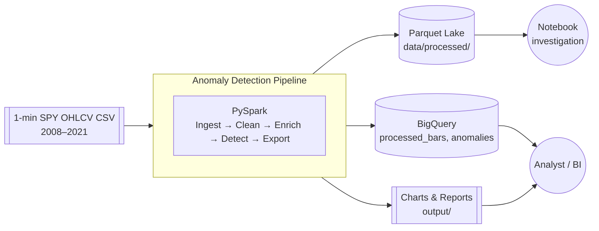
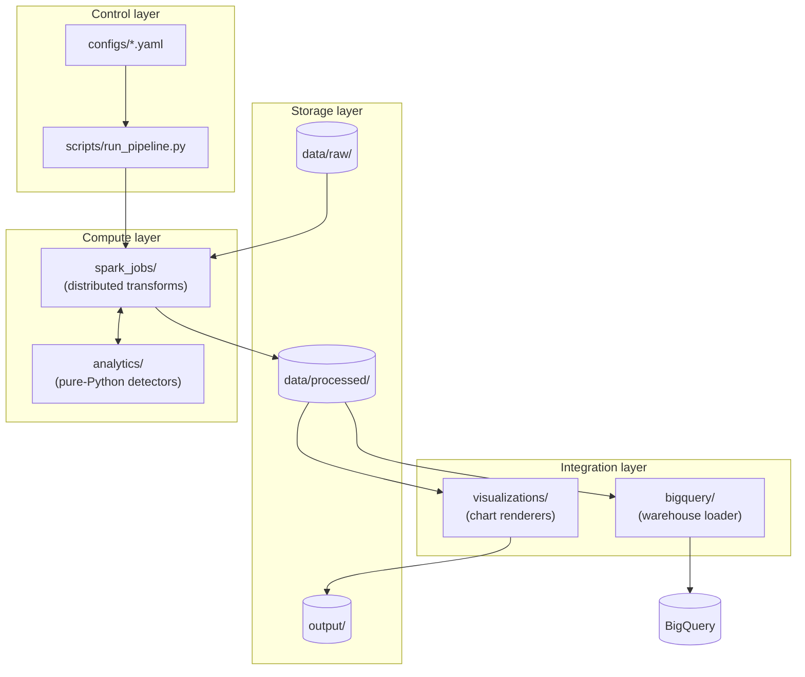
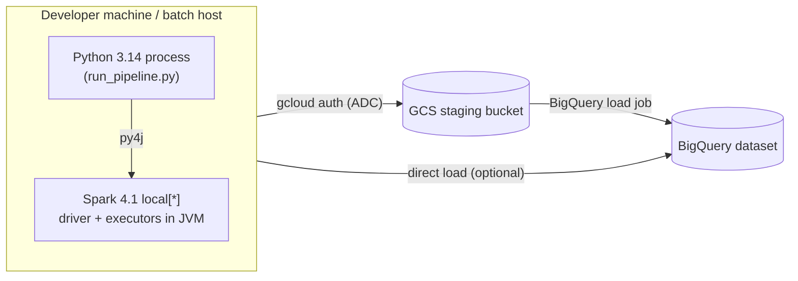

# Architecture

This document describes the high-level architecture of the financial market anomaly detection pipeline: the components, how they interact, the boundaries between them, and the reasoning behind each significant design decision.

The pipeline is a **batch-oriented, offline analytics system**. It ingests historical 1-minute SPY OHLCV bars, cleans and enriches them at scale with PySpark, applies statistical detectors to surface market anomalies, persists results to Google BigQuery, and produces reports and visualizations for downstream consumers. It is not a real-time trading system, and no design decision here trades correctness for latency.

---

## Design principles

1. **Batch, not streaming.** The data is historical. Streaming machinery would add operational cost with no analytic benefit.
2. **Stages are independently runnable.** Every stage reads from disk and writes to disk. Any stage can be rerun without rerunning the previous ones.
3. **Warehouse is a sink, not a bus.** BigQuery holds outputs for downstream analytics; stages communicate through Parquet on disk, not through the warehouse.
4. **Statistical logic is pure Python.** Detectors are testable without a Spark cluster and reusable inside notebooks.
5. **Configuration is data.** Every tunable (window sizes, thresholds, input paths, output tables) lives in YAML. Job code changes only when logic changes.
6. **One CSV in, one Parquet lake and one warehouse out.** No unexpected side effects, no hidden network calls.

These principles show up repeatedly below as the rationale for concrete choices.

---

## System context

**External systems.**

| System | Role | Direction |
| --- | --- | --- |
| Local CSV source | Ground-truth OHLCV history | inbound (read-only) |
| Google BigQuery | Query-serving warehouse | outbound (write); analysts read separately |
| Google Cloud Storage (staging) | Landing zone for load jobs | outbound (write) |

Nothing else is called at runtime. The pipeline has no dependency on live market data feeds, brokers, or third-party APIs.

---

## Logical components

The system decomposes into six logical components. Each maps to a directory in the repository (see `project-structure.md`) and to one or more stages of the batch pipeline (see `data-flow.md`).

### 1. Compute — `spark_jobs/`

Distributed transformations built on PySpark 4.1. Reads raw CSV, produces cleaned and enriched Parquet. Each stage (ingest, clean, enrich, detect, export) is a separate job module so it can be rerun in isolation. Spark configuration is loaded from `configs/spark.yaml`; the `SparkSession` is centrally constructed in `spark_jobs/session.py` with appName `"FinancialPipeline"`.

**Why Spark.** At 1-minute resolution across 14 years the SPY dataset is roughly 1.4M–1.9M rows — comfortably fits in memory today. Spark is chosen anyway because (a) the same code path must scale to multi-asset or multi-year expansions without a rewrite, (b) window functions over sorted time series are ergonomic in Spark SQL, and (c) partitioned Parquet output is native. The overhead of running Spark locally on this dataset is acceptable given the architectural payoff.

### 2. Compute — `analytics/`

Statistical logic: rolling z-scores, volatility measures, distribution tests, and the rule engine that combines detectors into anomaly labels. Written in pandas / NumPy / SciPy / statsmodels — no Spark imports.

**Why split from Spark.** Detectors evolve fast during research; pandas has the tighter iteration loop. Spark jobs call these functions via `mapInPandas` / grouped applies, so the same code is used in production and in notebooks. Unit tests run in milliseconds without a SparkSession.

### 3. Integration — `bigquery/`

The warehouse boundary. Handles authenticated client creation, schema definitions, and load-job orchestration. Reads Parquet from `data/processed/` (or a GCS staging path), writes to the configured BigQuery dataset.

**Why load jobs, not streaming inserts.** Load jobs are free, idempotent on identifiable filenames, and match the daily batch cadence. Streaming inserts would add cost, complicate retry semantics, and offer latency benefits this pipeline does not need.

### 4. Integration — `visualizations/`

Chart rendering. Consumes cleaned Parquet or in-memory pandas DataFrames and emits PNG/HTML into `output/`. Used from both `scripts/run_pipeline.py` (batch) and notebooks (interactive).

### 5. Storage — `data/{raw,processed}/`, `output/`

Three-tier storage: immutable raw input, derived processed Parquet, terminal output artifacts. See `data-flow.md` for the read/write contract of each tier.

### 6. Control — `scripts/` + `configs/`

The pipeline entry point is `scripts/run_pipeline.py`. It reads a YAML config, constructs the SparkSession, and invokes stage jobs in order. It is the only file that knows the end-to-end wiring; individual stage modules know only their own inputs and outputs.

**Why a script, not an orchestrator.** Airflow / Prefect / Dagster are appropriate when there are cross-DAG dependencies, retries with SLAs, or a scheduling contract. This pipeline has one linear DAG. A single script is the simplest thing that expresses that DAG faithfully, and it is easily wrapped by a future orchestrator without changing the stage code.

---

## Runtime topology

- The pipeline runs on a single machine using Spark's `local[*]` master.
- Authentication to Google Cloud uses Application Default Credentials, sourced from the path in `GOOGLE_APPLICATION_CREDENTIALS`.
- BigQuery loads go via GCS staging in the default path; direct load from local Parquet is a supported fallback for small runs.

Scaling out to a Spark cluster (Dataproc, EMR, Databricks) requires no code change: only the Spark master URL in `configs/spark.yaml` and the GCS path prefix in `configs/pipeline.yaml`.

---

## Component interaction and boundaries

### What crosses each boundary

| Boundary | What crosses | What does not |
| --- | --- | --- |
| `spark_jobs/` → `analytics/` | pandas DataFrames (grouped/partitioned) | Spark session, RDDs |
| `spark_jobs/` → filesystem | Parquet files, partitioned by date | JSON, CSV (except at ingest) |
| `scripts/` → `spark_jobs/` | Config objects, job invocations | Business logic |
| Any component → `bigquery/` | Parquet file paths, schema references | Raw SQL strings from callers |
| Notebooks → any module | Imported functions | Redefined analytics logic |

### Interfaces to hold stable

- **Processed Parquet schema.** Downstream analytics, BigQuery load, and visualizations all depend on it. Changes require a schema version bump and a coordinated update.
- **BigQuery table schemas.** External analytics consumers depend on column names and types. Additions are backward-compatible; renames and drops are breaking.
- **Analytics function signatures.** Notebook code across the team imports these; keep them versioned within the package.

### Interfaces that can churn freely

- Internal Spark job structure.
- Chart styling and layout in `visualizations/`.
- Log formats and script CLIs.

---

## Error handling and idempotency

**Idempotency by design.** Every stage writes to a run-scoped or date-scoped output path. Rerunning a stage with the same inputs overwrites the same outputs. There is no in-place mutation of data on disk.

**Failure model.**

| Failure | Response |
| --- | --- |
| Bad row in raw CSV (missing OHLCV, invalid date) | Quarantined to `data/processed/_quarantine/`, counted in metrics, does not fail the job. |
| Spark stage crash | Job exits non-zero; upstream stages remain valid on disk; operator reruns from the failed stage. |
| BigQuery load failure | Loader retries with exponential backoff up to the configured limit; on final failure, the run exits non-zero with the Parquet already on disk for retry. |
| Config drift (schema mismatch) | Validation at job start; the job fails fast before touching data. |

**No retries inside pure analytics.** Analytics functions are deterministic on their inputs; if they fail, the input is wrong and retries cannot help.

---

## Observability

- **Logs.** Structured JSON to `logs/{job}_{timestamp}.log` via `python-json-logger`. Every log record includes job name, stage, run-id, and row counts where applicable.
- **Row-count metrics.** Every stage emits `rows_in`, `rows_out`, and `rows_quarantined`. These are logged and also written as a small `_metrics.json` next to each stage output for later inspection.
- **Spark UI.** Available on the default port during a run; used for tuning shuffle partitions and skew detection.

No metrics endpoint, no dashboard, and no alerting are in scope. Batch failures are surfaced by exit codes and log inspection.

---

## Security

- Credentials for Google Cloud are supplied via `GOOGLE_APPLICATION_CREDENTIALS` and never committed. `.env` is gitignored.
- BigQuery dataset and project are also read from `.env` so the same code runs against a personal sandbox or a shared warehouse without modification.
- The pipeline has no inbound network surface. It is a batch program, not a service.
- Raw and processed data are non-sensitive public market data; no additional data protection controls are required.

---

## Scaling and evolution

The architecture leaves three obvious scaling axes open, none of which require a rewrite.

| Axis | Change required |
| --- | --- |
| More symbols (multi-asset) | Add a `symbol` column, partition Parquet by `(symbol, date)`, and parameterize the ingest path in config. |
| More history / higher frequency | Point Spark master at a cluster; increase `configs/spark.yaml` executor and shuffle settings. |
| More detectors | Add a module under `analytics/`, register it in `analytics/anomaly_rules.py`, wire thresholds in `configs/pipeline.yaml`. |

Deliberate non-goals for the first cut: streaming ingest, model training / serving, orchestrator integration, multi-region warehouse writes, and a web frontend. Each of these has an obvious insertion point (Kafka/Beam in front of Spark; MLflow next to `analytics/`; Airflow wrapping `run_pipeline.py`; multi-region config in `configs/`; a `web/` app reading BigQuery) — none is built until concretely required.

---

## Architecture Decision Records (ADR)

The records below capture the load-bearing decisions in this architecture. Each is written in the classic ADR form — **Decision**, **Context**, **Alternatives Considered**, **Consequences** — so future engineers can revisit a choice with full knowledge of what it displaced and why. When a decision is reversed, its ADR is marked **Superseded** and a successor is added rather than the original being rewritten.

Status legend: **Accepted** (in force) · **Proposed** (under discussion) · **Superseded** (replaced by a later ADR).

---

### ADR-001: Use PySpark instead of pandas for distributed batch processing

**Status.** Accepted.

**Decision.** Use PySpark 4.1 as the core batch-processing engine for all `spark_jobs/` stages (ingest, clean, enrich, detect, export).

**Context.** The current SPY dataset (~1.4–1.9M rows) fits comfortably into memory on a laptop, and a pure pandas implementation would be slightly faster today. But the architecture is explicitly expected to grow along at least two axes: multiple assets (adding a `symbol` dimension) and longer/higher-frequency history (multi-year, tick-level or multi-symbol universes). Rewriting a pandas pipeline into Spark later would touch every stage and every test — a change we would rather pay for once, upfront.

**Alternatives Considered.**

- **pandas.** Simplest, fastest at this data size, no JVM. Rejected because horizontal scaling requires a rewrite.
- **Dask.** Pandas-like API with distributed execution. Rejected because operational tooling (UI, connectors, cluster support) is narrower than Spark's, and the Spark SQL window API is a better fit for time-series feature engineering than Dask's DataFrame API.
- **Polars.** Excellent single-node performance and ergonomics. Rejected because distributed Polars is still maturing; committing now would trade a certain Spark migration for an uncertain Polars one.

**Consequences.**

- Slightly higher local execution overhead (JVM startup, shuffle serialization) on the current dataset.
- Same code scales to a cluster by changing only the Spark master URL — no logic rewrite.
- Statistical detectors are kept out of Spark (see ADR-005) so the pandas iteration loop is preserved where it matters most.
- Team must maintain PySpark familiarity; new contributors have a steeper first day.

---

### ADR-002: Use Parquet as the intermediate storage format

**Status.** Accepted.

**Decision.** Every inter-stage handoff on disk is written as Parquet, partitioned by trading `date`.

**Context.** Stages communicate through the filesystem so any stage can be rerun in isolation (see ADR-004 and the "stages are independently runnable" principle). The intermediate format has to support columnar reads (detectors touch a subset of columns), schema evolution (new derived columns get added over time), and native Spark I/O without conversion glue.

**Alternatives Considered.**

- **CSV.** Human-readable, universally supported. Rejected: no schema, no compression, no columnar reads, and re-parsing dates on every stage is wasted work.
- **JSON / JSONL.** Rejected for the same reasons as CSV, plus larger on-disk footprint.
- **Feather / Arrow IPC.** Fast, but poorer partitioning story and weaker ecosystem support in Spark and BigQuery load.
- **Delta Lake / Iceberg.** Adds ACID semantics and time travel. Rejected as premature for a single-writer batch pipeline; the operational overhead is not justified until concurrent writers or streaming ingest are in scope. Documented here as the obvious upgrade path.

**Consequences.**

- Small, self-describing files with column pruning and predicate pushdown for every downstream read.
- BigQuery load jobs can consume Parquet directly with no conversion step.
- Not human-readable; debugging requires `pyarrow` or `spark.read.parquet(...).show()`. Acceptable given the frequency of raw inspection.
- Table-format upgrade (to Delta or Iceberg) remains available without rewriting stage code — only the write path changes.

---

### ADR-003: Use Google BigQuery as the analytics warehouse

**Status.** Accepted.

**Decision.** Persist processed bars and detected anomalies to BigQuery via load jobs from GCS-staged Parquet.

**Context.** The pipeline needs a query-serving surface that analysts and future BI tools can hit without spinning up Spark. The warehouse is a *sink*, not a communication bus — Spark stages talk to each other through Parquet, not through the warehouse (see the principle "warehouse is a sink, not a bus" in the design principles section).

**Alternatives Considered.**

- **PostgreSQL / MySQL.** Familiar, cheap, transactional. Rejected: row-store engines are ill-suited to columnar analytical scans over years of minute bars, and operational responsibility for a database instance is out of scope.
- **Snowflake.** Comparable capabilities. Rejected because the project already has Google Cloud credentials in `.env`, and BigQuery's serverless pricing and load-job semantics match a batch pipeline exceptionally well.
- **DuckDB on Parquet.** Lightweight, no service. Rejected as an *addition*, not a replacement: DuckDB is a fine local query tool over `data/processed/`, but does not give analysts a shared, always-on query surface.
- **Streaming inserts to BigQuery.** Rejected in favor of load jobs — load jobs are free, idempotent per file, and match the daily batch cadence. Streaming would add cost without latency benefit.

**Consequences.**

- Analysts get a fast, serverless SQL surface with `date`-partitioned tables.
- Loads are cost-free and idempotent; reruns overwrite specific date partitions safely.
- Vendor lock-in to Google Cloud — mitigated by the fact that the source of truth (`data/raw/`) and the derived truth (`data/processed/`) both live outside BigQuery.
- Credentials must be managed via `GOOGLE_APPLICATION_CREDENTIALS`; no additional secrets infrastructure needed.

---

### ADR-004: Use batch processing instead of streaming

**Status.** Accepted.

**Decision.** The pipeline is batch-oriented. Stages are triggered by `scripts/run_pipeline.py`, read whole partitions from disk, and write whole partitions back.

**Context.** The source data is historical (2008–2021). There is no live market feed and no downstream consumer with a sub-daily SLA. Streaming machinery (Kafka / Kinesis / Structured Streaming) would add operational complexity — checkpoints, watermarks, delivery-guarantee reasoning — with no analytical payoff.

**Alternatives Considered.**

- **Spark Structured Streaming.** Same engine, streaming semantics. Rejected because there is no stream to consume.
- **Micro-batch every N minutes.** A middle ground for future live data. Rejected as speculative; the stage boundary that already exists (Parquet on disk) is compatible with a micro-batch driver, so nothing prevents adopting one later.
- **Event-driven per-file ingestion.** Same rejection as above — no upstream event source exists.

**Consequences.**

- Simple failure model: a stage either succeeds and writes its output, or fails and leaves upstream state untouched (see "Error handling and idempotency").
- Rerunning a stage is a trivial operator action — no offset management, no state store.
- If live data arrives later, the same stage boundaries can be driven by a streaming source with only the `ingest.py` entry point rewritten. The rest of the pipeline is agnostic to arrival cadence.
- Backfills are natural: point the ingest stage at a different date range and rerun.

---

### ADR-005: Keep anomaly detection logic independent from Spark

**Status.** Accepted.

**Decision.** All statistical detectors — rolling z-scores, volatility measures, distribution tests, the rule engine — live in `analytics/` as pure pandas / NumPy / SciPy / statsmodels functions. Spark jobs invoke them via `mapInPandas` or grouped applies but never redefine the logic.

**Context.** Detectors evolve fast during research: parameter sweeps, new thresholding schemes, added rules. That iteration loop must be tight. Pandas offers a millisecond REPL cycle; Spark does not. Analytics functions also need to be reachable from notebooks unchanged, so a research finding transfers to production by importing the same function, not by porting logic across engines.

**Alternatives Considered.**

- **Native Spark SQL / DataFrame expressions.** Fastest at scale, but poor testability without a SparkSession and painful to iterate on in a notebook.
- **Spark UDFs written in Python without pandas boundaries.** Rejected because per-row UDFs are slow and force per-row logic; window logic is cleaner over a whole pandas partition.
- **Two implementations (one for Spark, one for notebooks).** Rejected outright — divergence is only a matter of time, and correctness would drift silently.

**Consequences.**

- Unit tests for detectors run in milliseconds with no Spark dependency.
- Notebook prototypes become production code with a single import move.
- Grouped-apply / `mapInPandas` boundaries mean detector functions must be safe to call on a per-partition pandas DataFrame — an explicit, documented contract in `analytics/`.
- Very large single partitions could pressure memory in the Python worker; mitigated by partitioning on `date`, which caps each partition at one trading day.

---

### ADR-006: Configuration as YAML data, not code

**Status.** Accepted.

**Decision.** Every runtime parameter — window sizes, threshold multipliers, input paths, output tables, Spark tunables — is expressed in YAML under `configs/`. Job code loads the config at startup and treats it as immutable.

**Context.** Reproducibility of a pipeline run is defined by two things: the code at a git SHA and the config that was passed in. If parameters are baked into the code, every parameter sweep becomes a code change, git history becomes noisy, and reruns for backfills require branch juggling.

**Alternatives Considered.**

- **Python config modules.** Executable, flexible. Rejected because "flexible" means "can call arbitrary code," which defeats reproducibility and makes diffs hard to review.
- **CLI flags only.** Fine for a one-off script; unmanageable for a pipeline with dozens of parameters.
- **TOML / JSON.** Comparable to YAML on capability. YAML picked for human editability and comment support; TOML would be an acceptable substitute.
- **Environment variables for everything.** Reserved for secrets and deploy-time paths only — hiding analytical parameters in the environment makes reruns hard to reproduce.

**Consequences.**

- Reruns are defined by (git SHA, config file) — trivially reproducible.
- Parameter sweeps are a matter of changing a YAML, not changing code.
- Configs must be validated at job start (schema check + range check) so typos fail fast, not silently.
- Secrets never live in configs; `.env` is the only secret sink.

---

### ADR-007: Single-script entry point instead of an orchestrator

**Status.** Accepted.

**Decision.** End-to-end pipeline execution is driven by `scripts/run_pipeline.py`, a thin CLI that wires configs to stages in linear order. No Airflow, Prefect, or Dagster in the first cut.

**Context.** Orchestrators earn their operational cost when there are cross-DAG dependencies, SLA-driven retries, scheduling contracts with other teams, or long-running human-in-the-loop workflows. This pipeline has one linear DAG, one operator, and no external schedule.

**Alternatives Considered.**

- **Apache Airflow.** Powerful and standard. Rejected as premature — significant setup and maintenance overhead for a linear DAG that a script expresses just as faithfully.
- **Prefect / Dagster.** Lower-friction than Airflow, but the same argument applies: the pipeline is not yet complex enough to earn back the cost.
- **Makefile.** Considered as an even simpler layer. Rejected because Python config parsing and Spark session construction are more naturally done in Python than shelled out from Make.

**Consequences.**

- Zero orchestration infrastructure to maintain.
- Any future orchestrator can wrap `run_pipeline.py` (or the per-stage entry points) without touching stage code.
- No built-in retries, alerting, or scheduling — those are explicitly out of scope for the current cut and are the primary trigger for revisiting this ADR.

---

## Cross-references

- `data-flow.md` — how a row moves through the stages, with schemas at each boundary.
- `tech-stack.md` — the specific technologies picked at each layer and why.
- `project-structure.md` — directory-by-directory reference.
