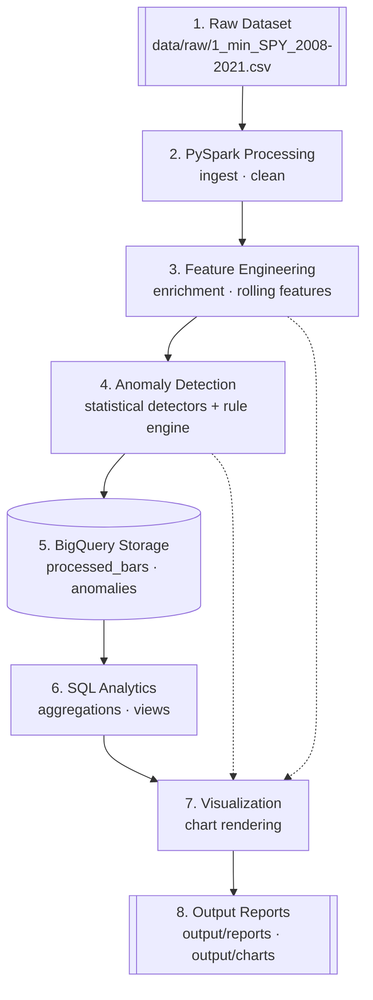
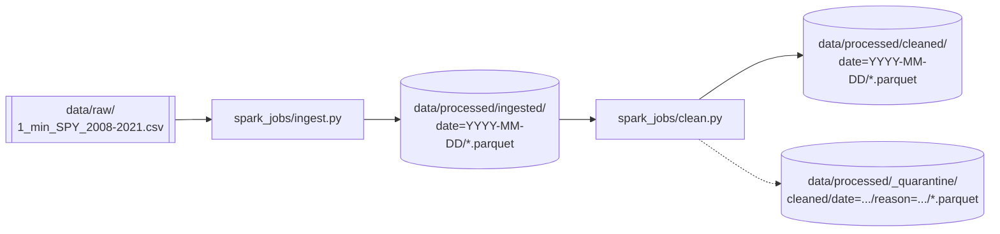
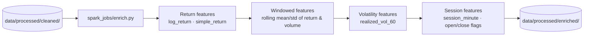
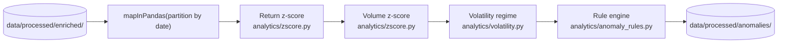
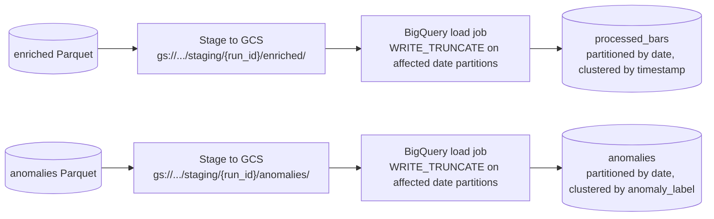
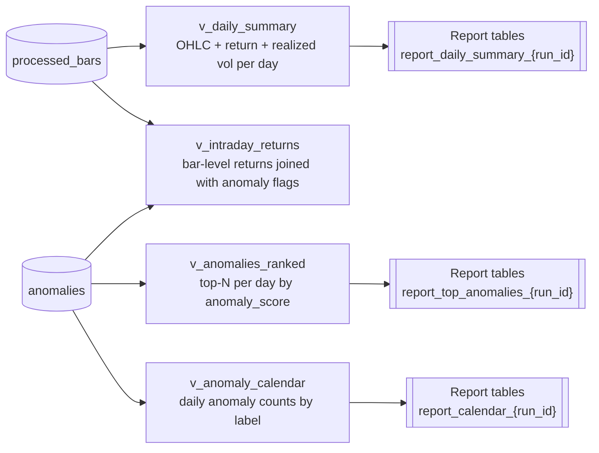
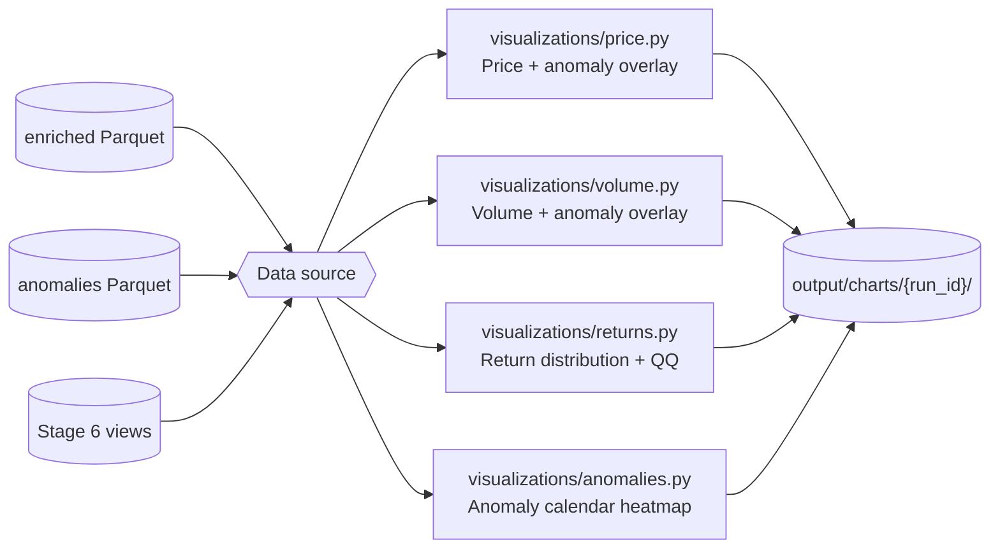
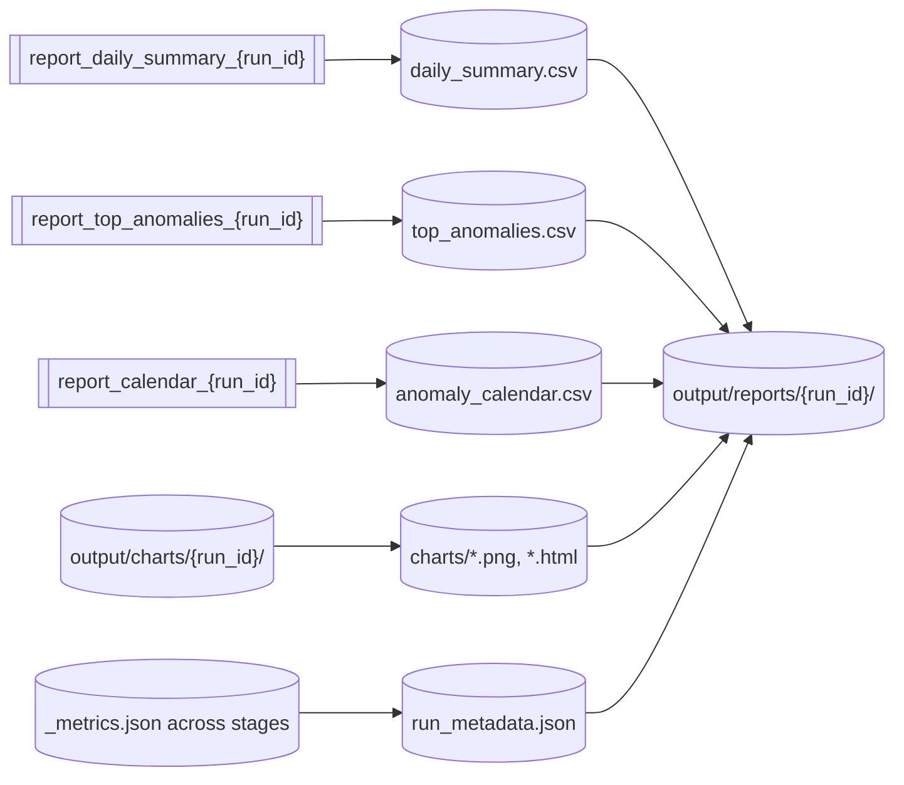

# Data Flow

This document traces the end-to-end journey of the data through the pipeline: from the raw SPY CSV on disk to the final reports that land in `output/`. It defines, for each stage, what is read, what is written, what is transformed, and why. It is the reference an engineer should hold open while implementing any stage.

Where `architecture.md` describes *components* and `project-structure.md` describes *directories*, this document describes *data* — every dataset, every schema, every boundary.

---

## End-to-end pipeline

The pipeline is a linear DAG of eight logical stages. Every stage reads from a durable location (filesystem Parquet or BigQuery) and writes to a durable location. No stage relies on in-memory state from another stage.



Solid arrows are the mainline flow. Dotted arrows indicate that visualization can also be driven directly from the Parquet lake (`data/processed/`) when a run does not need the warehouse — for example, during local iteration.

---

## Storage tiers at a glance

Before walking each stage, a summary of where data physically lives:

| Tier | Location | Owner stage(s) | Format | Retention | Gitignored? |
| --- | --- | --- | --- | --- | --- |
| Raw | `data/raw/` | Stage 1 | CSV | Indefinite (immutable) | Yes |
| Ingested | `data/processed/ingested/` | Stage 2a | Parquet, partitioned by `date` | Rebuildable | Yes |
| Cleaned | `data/processed/cleaned/` | Stage 2b | Parquet, partitioned by `date` | Rebuildable | Yes |
| Enriched | `data/processed/enriched/` | Stage 3 | Parquet, partitioned by `date` | Rebuildable | Yes |
| Anomalies | `data/processed/anomalies/` | Stage 4 | Parquet, partitioned by `date` | Rebuildable | Yes |
| Quarantine | `data/processed/_quarantine/` | Stage 2b | Parquet, partitioned by `date` + `reason` | Audit trail | Yes |
| Warehouse | BigQuery `processed_bars`, `anomalies` | Stage 5 | Managed tables, partitioned by `date` | Table lifecycle | N/A |
| Reports | `output/reports/{run_id}/` | Stage 8 | CSV | Per-run | Yes |
| Charts | `output/charts/{run_id}/` | Stage 7 | PNG + HTML | Per-run | Yes |

Every derived tier can be regenerated from `data/raw/` plus the code and configs in the repository. That property is the operational contract of the pipeline.

---

## Stage 1 — Raw Dataset

**Location.** `data/raw/1_min_SPY_2008-2021.csv`
**Format.** CSV with a header row.
**Volume.** ~1.4–1.9M rows across US regular trading hours, 2008–2021.
**Owner.** The dataset is *input*; no stage writes here.

**Schema as delivered.**

| Column | Type | Notes |
| --- | --- | --- |
| `date` | string | Format `YYYYMMDD  HH:MM:SS` — **double-space** between date and time. Documented in `CLAUDE.md`. |
| `open` | float | Open price for the 1-minute bar. |
| `high` | float | High price for the bar. |
| `low` | float | Low price for the bar. |
| `close` | float | Close price for the bar. |
| `volume` | integer | Shares traded during the bar. |
| `barCount` | integer | Number of trades composing the bar. |
| `average` | float | Volume-weighted average price for the bar. |

**Contract for downstream.** The raw CSV is *immutable*. If a source is discovered to be wrong, it is re-downloaded, not patched in place. Every derived tier must be rebuildable from this CSV alone.

**Rationale for treating raw as immutable.** Lineage is only meaningful if the ground truth does not shift under it. Patching raw data would silently invalidate every historical run stored downstream.

---

## Stage 2 — PySpark Processing

Stage 2 splits into two Spark jobs — **ingest** and **clean** — with a durable Parquet handoff between them. Splitting is deliberate: ingest is deterministic on the source file and cheap to rerun; cleaning encodes evolving business rules (invariants, quarantine reasons) and iterates more often. Keeping them as separate jobs means an evolving cleaning rule does not force a reparse of the CSV.



### Stage 2a — Ingest

**Job.** `spark_jobs/ingest.py`
**Reads.** `data/raw/1_min_SPY_2008-2021.csv`
**Writes.** `data/processed/ingested/date=YYYY-MM-DD/*.parquet`

**Transformations.**

1. Load the CSV with an **explicitly declared schema** (no `inferSchema=True`; inference is nondeterministic across partitions and would silently change types).
2. Parse the source `date` column using the exact format `yyyyMMdd  HH:mm:ss` (double space) into a native `timestamp`.
3. Derive a `date` partition column (`DATE`) from the timestamp.
4. Rename `barCount` → `bar_count` for snake_case consistency across the pipeline.
5. Write partitioned Parquet under `data/processed/ingested/`, one partition per trading day.

**Output schema.**

| Column | Type | Notes |
| --- | --- | --- |
| `timestamp` | timestamp | Parsed from source `date`. |
| `open` | double | |
| `high` | double | |
| `low` | double | |
| `close` | double | |
| `volume` | long | |
| `bar_count` | long | Renamed from `barCount`. |
| `average` | double | VWAP of the bar. |
| `date` | date | Partition key. |

**Design decisions.**

- **Partition by `date` at the earliest possible stage.** All downstream stages window within a trading day and BigQuery partitions by `date`. Aligning early avoids reshuffles later.
- **Case-normalized column names.** The rename happens exactly once, at the raw → ingested boundary, so no downstream code has to remember the source's camelCase.
- **Schema declared, not inferred.** Determinism outranks the mild convenience of inference.

**Failure modes.**

- Malformed date strings → the row is routed to quarantine at Stage 2b (ingest does not silently drop).
- Wrong column count → the CSV is rejected wholesale; a partial ingest is never committed.

### Stage 2b — Clean

**Job.** `spark_jobs/clean.py`
**Reads.** `data/processed/ingested/`
**Writes.**
- Good rows → `data/processed/cleaned/date=YYYY-MM-DD/*.parquet`
- Bad rows → `data/processed/_quarantine/cleaned/date=YYYY-MM-DD/reason=<reason>/*.parquet`

**Transformations.**

1. **Deduplicate** on `timestamp` (keep first occurrence; log collisions).
2. **Drop-null gate** on `open`, `high`, `low`, `close`, `volume`. Rows with any null go to quarantine with `reason=null_ohlcv`.
3. **OHLC invariants**:
   - `high >= max(open, close)`
   - `low  <= min(open, close)`
   - `high >= low`
   - all prices `> 0`
   Violations quarantined with `reason=ohlc_invariant`.
4. **Non-negative counts**: `volume >= 0`, `bar_count >= 0`. Violations quarantined with `reason=negative_count`.
5. **Session filter**: keep only US regular trading hours 09:30–16:00 America/New_York. Extended-hours bars quarantined with `reason=extended_hours`.

**Output schema.** Identical to Stage 2a. Cleaning removes rows and routes rejects; it does not add columns.

**Design decisions.**

- **Quarantine, don't discard.** Every dropped row is preserved with a reason label. Data-quality regressions are then auditable via a SQL count over the quarantine tree.
- **Regular trading hours only.** The chosen detectors assume a homogeneous liquidity regime; mixing regular and extended sessions would confound them.
- **Invariants enforced explicitly.** Silent tolerance of `high < low` would corrupt every downstream feature and every detector.

**Metrics emitted.** `rows_in`, `rows_out`, `rows_quarantined`, and a per-reason count. Written as `_metrics.json` next to the stage output.

---

## Stage 3 — Feature Engineering

**Job.** `spark_jobs/enrich.py`
**Reads.** `data/processed/cleaned/`
**Writes.** `data/processed/enriched/date=YYYY-MM-DD/*.parquet`

Feature engineering is the point at which the raw bar becomes analytically useful. Every downstream stage — detection, warehouse export, SQL analytics, visualization — reads from the enriched dataset (either directly on disk or via its BigQuery mirror). Because so many consumers depend on it, **the enriched schema is the pipeline's most stable public contract**.



### Transformations

All windowed computations run **inside a single trading day** — the window function is partitioned by `date` and ordered by `timestamp`. No feature crosses a day boundary. This matches how the detectors and analysts reason about the data and eliminates a class of bugs at the market-close/open seam.

**Return features.**

| Column | Definition |
| --- | --- |
| `log_return` | `ln(close_t / close_{t-1})`. Null on the first bar of the day. |
| `simple_return` | `close_t / close_{t-1} - 1`. Null on the first bar of the day. |

**Windowed return statistics** (defaults from `configs/pipeline.yaml`; window width encoded in the column name so schema stays predictable).

| Column | Definition |
| --- | --- |
| `rolling_mean_return_20` | 20-bar rolling mean of `log_return`. |
| `rolling_std_return_20`  | 20-bar rolling standard deviation of `log_return`. |

**Volatility feature.**

| Column | Definition |
| --- | --- |
| `realized_vol_60` | `sqrt(sum(log_return^2))` over a trailing 60-bar window. |

**Volume statistics.**

| Column | Definition |
| --- | --- |
| `volume_rolling_mean_20` | 20-bar rolling mean of `volume`. |
| `volume_rolling_std_20`  | 20-bar rolling standard deviation of `volume`. |

**Session context.**

| Column | Type | Definition |
| --- | --- | --- |
| `session_minute` | int | Minute index within the session (0 = 09:30 ET). |
| `is_session_open`  | boolean | First 5 minutes of the session. |
| `is_session_close` | boolean | Last 5 minutes of the session. |

**Output schema.** All Stage 2 columns, unchanged, plus every column defined above.

### Design decisions

- **Window sizes are config-driven, not hard-coded.** Defaults live in `configs/pipeline.yaml`; the column name embeds the default so consumers do not have to look up which window produced a value.
- **Windows respect session boundaries.** A new trading day starts a new window — no leakage across the overnight seam.
- **Enrichment is idempotent and deterministic.** Given the same cleaned input and config, the enriched output is byte-identical modulo file-time metadata. This makes reruns safe.
- **Enriched, not aggregated.** Every input bar produces one output bar. Aggregations happen later in SQL analytics; keeping them out of the pipeline stage preserves the maximum amount of information for the detectors.

---

## Stage 4 — Anomaly Detection

**Job.** `spark_jobs/detect.py` orchestrates. Statistical logic lives in `analytics/`.
**Reads.** `data/processed/enriched/`
**Writes.** `data/processed/anomalies/date=YYYY-MM-DD/*.parquet`

Detection is the analytical heart of the pipeline. Spark's role is purely orchestration: partition the enriched data by `date`, hand each partition to a pandas DataFrame via `mapInPandas`, and let the detectors — pure Python functions in `analytics/` — do the work.



### Detectors

Thresholds live in `configs/pipeline.yaml`; the detector code contains no numeric constants.

**Return z-score.** Flag bars where the standardized return exceeds `threshold_return` in absolute value:

```
|log_return - rolling_mean_return_20| / rolling_std_return_20  >  threshold_return
```

**Volume z-score.** Flag bars where volume is anomalously large relative to its rolling baseline:

```
(volume - volume_rolling_mean_20) / volume_rolling_std_20  >  threshold_volume
```

Only the upper tail is flagged — an unusually *quiet* bar is not the anomaly this pipeline is designed to surface.

**Volatility regime.** Flag bars that sit in a high-volatility regime:

```
realized_vol_60  >  quantile(realized_vol_60, q) computed over a trailing window
```

### Rule engine

`analytics/anomaly_rules.py` combines detector outputs into a final label and a composite score:

| Column | Type | Definition |
| --- | --- | --- |
| `is_return_anomaly` | boolean | Return z-score exceeded threshold. |
| `is_volume_anomaly` | boolean | Volume z-score exceeded threshold. |
| `is_volatility_regime` | boolean | Bar sits in a high-volatility regime. |
| `anomaly_label` | string | `none` \| `return` \| `volume` \| `volatility` \| `composite`. |
| `anomaly_score` | double | Weighted magnitude used for ranking (weights in config). |

`composite` is emitted when two or more detectors fire on the same bar — the label most likely to interest an analyst.

### Output schema

The anomalies dataset is a per-bar table (not a filtered subset). Columns:

| Column | Type | Purpose |
| --- | --- | --- |
| `timestamp` | timestamp | Bar timestamp. |
| `date` | date | Partition key. |
| `close` | double | Carried through for downstream joins and charts. |
| `log_return` | double | Carried through for downstream joins and charts. |
| `return_zscore` | double | Signed z-score. |
| `volume_zscore` | double | Signed z-score. |
| `is_return_anomaly` | boolean | See above. |
| `is_volume_anomaly` | boolean | See above. |
| `is_volatility_regime` | boolean | See above. |
| `anomaly_label` | string | See above. |
| `anomaly_score` | double | See above. |
| `run_id` | string | Pipeline run identifier — enables end-to-end lineage. |

### Design decisions

- **Detectors are pure Python.** Kept out of Spark for testability and notebook reuse — see ADR-005.
- **Labels, don't filter.** Every bar is emitted with detector output. Filtering at write-time would discard information needed for later threshold calibration.
- **`run_id` embedded in every row.** Lineage is queryable directly: *"Which run produced these anomalies?"* answered with a `WHERE run_id = ...` clause in BigQuery.
- **Thresholds are config-driven.** No magic numbers anywhere in `analytics/`.

---

## Stage 5 — BigQuery Storage

**Job.** `spark_jobs/export.py` stages files; `bigquery/loader.py` performs the load.
**Reads.** `data/processed/enriched/` and `data/processed/anomalies/`.
**Writes.**
- `${BIGQUERY_PROJECT}.${BIGQUERY_DATASET}.processed_bars`
- `${BIGQUERY_PROJECT}.${BIGQUERY_DATASET}.anomalies`



### Table design

**`processed_bars`.** Full-fidelity mirror of `data/processed/enriched/`. Partitioned by `date`. Clustered by `timestamp`. Every column from Stage 3 is preserved, plus `run_id`.

**`anomalies`.** Full-fidelity mirror of `data/processed/anomalies/`. Partitioned by `date`. Clustered by `anomaly_label` so the common analyst query — *"give me every composite anomaly last quarter"* — hits a small cluster range.

### Load semantics

- **Load jobs, not streaming inserts.** Free, idempotent per staged file, and appropriate for the daily batch cadence.
- **`WRITE_TRUNCATE` on the affected date partitions.** A rerun for a given date range replaces exactly those partitions and leaves other dates untouched. Backfills are safe by construction.
- **Staging via GCS.** Parquet is uploaded to a staging prefix keyed by `run_id`; the load job references that prefix; the staging files can be garbage-collected once the load succeeds.

### Design decisions

- **Warehouse is a sink, not a bus.** Stage-to-stage communication is Parquet on disk. BigQuery serves *downstream* consumers (Stage 6 SQL analytics, Stage 7 visualization, external BI); no Spark stage reads back from it.
- **Schema stability guaranteed via `bigquery/schemas.py`.** Declared once, checked before every load. A schema drift in the Parquet output fails the load before it can pollute the table.
- **`run_id` is a table column.** Enables cross-run queries (comparisons, regression detection) directly in SQL.

---

## Stage 6 — SQL Analytics

**Reads.** BigQuery tables `processed_bars`, `anomalies`.
**Writes.** BigQuery **views** (materialized on read) plus optional **result tables** consumed by Stage 7 and Stage 8.
**Code location.** SQL held as versioned files under `bigquery/queries.py` (parameterized query strings) and `bigquery/ddl/` (view definitions).

SQL analytics is the layer where the pipeline's outputs become answers. It is intentionally thin — the heavy computation happened in Stages 2–4 — and its job is to reshape those outputs into forms the human consumers (analysts, chart renderers, report writers) can use directly.



### Standard views

- **`v_daily_summary`** — one row per trading day: open, high, low, close, session volume, average realized volatility, count of each anomaly label.
- **`v_intraday_returns`** — bar-level returns joined with the corresponding row from `anomalies`; the canonical source for intraday visualization.
- **`v_anomalies_ranked`** — anomalies ordered by `anomaly_score` within each `date`; top-N extracts feed the daily report.
- **`v_anomaly_calendar`** — daily counts of `return`, `volume`, `volatility`, and `composite` anomalies; feeds the calendar heatmap in the report.

### Query patterns

The views implement the analytical patterns the pipeline is designed to answer:

| Question | Pattern |
| --- | --- |
| *"How volatile was each day?"* | Group `processed_bars` by `date`; aggregate `realized_vol_60`. |
| *"Which bars are the most anomalous?"* | Rank `anomalies` by `anomaly_score` within `date`. |
| *"How does anomaly frequency evolve over years?"* | Group `anomalies` by `DATE_TRUNC(date, MONTH)` and label. |
| *"Did detector thresholds move between runs?"* | Group by `run_id` and compare counts / score distributions. |

### Design decisions

- **Views for stable read patterns; result tables only for the report pipeline.** Views cost nothing to keep and are always current; materialized result tables are used only when Stage 7 or Stage 8 needs a stable, cheap snapshot for a specific run.
- **SQL lives in the repo, not in the warehouse UI.** Views are defined in `bigquery/ddl/*.sql` and applied via `bigquery/loader.py`, so a code review is required to change them.
- **Parameterized queries only.** No string interpolation of user input; parameters flow through the BigQuery client's parameter API.
- **Partition pruning is mandatory.** Every query in `bigquery/queries.py` includes a `date` filter to keep scanned bytes bounded.

---

## Stage 7 — Visualization

**Modules.** `visualizations/`
**Reads.** `data/processed/enriched/`, `data/processed/anomalies/`, or the equivalent BigQuery views (Stage 6).
**Writes.** `output/charts/{run_id}/*.png` and `output/charts/{run_id}/*.html`.



### Chart catalogue

| Chart | Module | Renderer | Purpose |
| --- | --- | --- | --- |
| **Price with anomaly overlay** | `visualizations/price.py` | matplotlib PNG | Close price time series with anomaly markers colored by `anomaly_label`. |
| **Volume with anomaly overlay** | `visualizations/volume.py` | matplotlib PNG | Volume bars with anomalous bars highlighted. |
| **Return distribution** | `visualizations/returns.py` | matplotlib PNG | Histogram + QQ plot of `log_return`; annotated with realized skew/kurtosis. |
| **Anomaly calendar heatmap** | `visualizations/anomalies.py` | matplotlib PNG | Days-of-year × years grid, cell color = daily anomaly count. |
| **Interactive intraday explorer** | `visualizations/price.py` | plotly HTML | Zoomable intraday chart for a specified date range. |

### Design decisions

- **Consumers over renderers.** Each chart is a pure function of a DataFrame; the caller (batch script or notebook) decides where the data comes from and where the output goes.
- **Batch charts are matplotlib PNG.** Compact, embeddable in reports, no browser required.
- **Interactive charts are plotly HTML.** Standalone files that render in any browser — the same artifact serves the notebook loop and the shared review link.
- **Shared theming.** `visualizations/theme.py` centralizes styling so every chart is visually consistent without callers duplicating configuration.
- **Notebook parity.** The same chart functions used by the batch report are the ones a notebook calls interactively — no divergence between "prototype" and "production" visualization.

---

## Stage 8 — Output Reports

**Producer.** `scripts/run_pipeline.py` (final step) or a dedicated `scripts/generate_report.py`.
**Reads.** Stage 6 result tables (or their Parquet equivalents) and Stage 7 chart files.
**Writes.** `output/reports/{run_id}/`

The final stage assembles a run's artifacts into a self-contained report bundle — the deliverable an analyst or reviewer opens.



### Report bundle contents

Every `output/reports/{run_id}/` directory contains:

| Artifact | Format | Source | Purpose |
| --- | --- | --- | --- |
| `daily_summary.csv` | CSV | `v_daily_summary` / `report_daily_summary_{run_id}` | One row per trading day; the top-level narrative. |
| `top_anomalies.csv` | CSV | `v_anomalies_ranked` | The highest-scoring anomalies per day. |
| `anomaly_calendar.csv` | CSV | `v_anomaly_calendar` | Long-format calendar of anomaly counts. |
| `charts/` | PNG + HTML | Stage 7 output copied in | Visual companion to the CSVs. |
| `run_metadata.json` | JSON | Aggregated `_metrics.json` from every stage + config snapshot | Row counts, quarantine counts, git SHA, config hash, run timestamps. |

### Design decisions

- **CSV, not Parquet, for the report layer.** These artifacts are read by humans and by spreadsheet software. Parquet is the wrong format for that audience; Parquet already exists in `data/processed/` for tool-driven consumers.
- **Self-contained by `run_id`.** A report bundle can be zipped and shared without needing the warehouse or the Parquet lake — everything a reader needs is inside the directory.
- **`run_metadata.json` closes the lineage loop.** With the git SHA and config hash in hand, any bundle is fully reproducible.
- **No PDF generation in scope.** PDFs would add rendering dependencies without solving a stated problem; CSV + PNG + HTML is enough for the analyst workflow.

---

## Lineage summary

Given any single row in the `output/reports/{run_id}/top_anomalies.csv` bundle, the following trace is possible with only artifacts inside the repository and the warehouse:

1. **`run_id` + `timestamp`** locate the row in BigQuery `anomalies` (Stage 5).
2. That row corresponds 1:1 to a row in `data/processed/anomalies/` (Stage 4).
3. Which was derived from a row in `data/processed/enriched/` (Stage 3).
4. Which was derived from a row in `data/processed/cleaned/` (Stage 2b).
5. Which came from a row in `data/processed/ingested/` (Stage 2a) — or a corresponding record in `data/processed/_quarantine/` if it was rejected.
6. Which came from a specific line in `data/raw/1_min_SPY_2008-2021.csv` (Stage 1).

Combined with the git SHA and config hash recorded in `run_metadata.json`, this makes any reported anomaly re-derivable exactly. That end-to-end traceability — source line to CSV row — is the operational contract of the pipeline and the reason every stage boundary above is treated as a stable schema.

---

## Schema evolution policy

- **Additions are non-breaking.** New columns may be added to enriched, anomaly, or warehouse schemas without a version bump.
- **Renames and drops are breaking.** They require a coordinated PR that updates schema files (`bigquery/schemas.py`), the affected Spark stage, downstream consumers, and this document in the same change.
- **Types are stable.** Widening (int → long, float → double) is allowed at explicit stage boundaries; narrowing is never allowed silently.
- **Partitioning is stable.** `date` is the partition key at every stage. Changing it would ripple through every consumer and is out of scope short of a rearchitecture.

---

## Cross-references

- `architecture.md` — components, boundaries, and architecture decision records that produced this flow.
- `tech-stack.md` — the specific technologies picked at each layer and why.
- `project-structure.md` — directory-by-directory reference.
