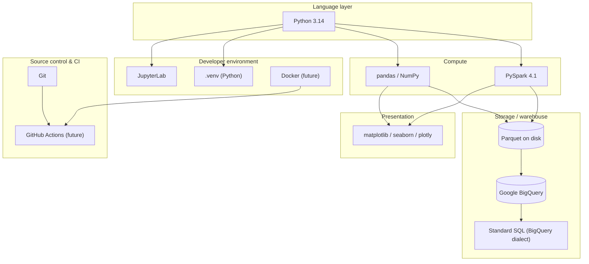

# Tech Stack

This document catalogues every technology the pipeline depends on, why it was chosen, what it was chosen *over*, the role it plays end-to-end, and the scale and limitations it is expected to operate within. It is the reference an engineer should read before adding, removing, or upgrading a dependency.

The technology list is deliberately short. Each addition to a stack is a new failure mode, a new upgrade cadence, and a new thing a future contributor must learn. The bar for adding anything is: *does it earn its complexity against the alternatives already in the stack?*

Where a technology's rationale is spelled out at length in an Architecture Decision Record, this document links to it rather than duplicating.

---

## At a glance

---

## Language layer

### Python 3.14

**Purpose.** The single implementation language for every stage of the pipeline — ingestion, cleaning, feature engineering, detection, warehouse loading, visualization, orchestration, and tests.

**Why it was chosen.**

- The data-engineering and scientific-Python ecosystems (PySpark, pandas, NumPy, SciPy, statsmodels, Google Cloud client libraries, matplotlib, plotly) are all first-class in Python. Any other choice would trade ecosystem access for marginal language benefits.
- Python 3.14 specifically: it is the current release, matches the version pinned in `.venv/` and referenced in `CLAUDE.md`, and enjoys stable wheels for every dependency in `requirements.txt`.
- One language across the codebase means one debugging story, one packaging story, and one review skill set.

**Alternatives considered.**

- **Scala.** The historical "native" Spark language. Rejected because the pipeline's analytical logic lives outside Spark (`analytics/`) and pandas-based iteration is central to the research loop. Adding Scala would fracture the codebase.
- **Java.** Same rejection as Scala, with worse iteration ergonomics.
- **R.** Excellent for statistical work. Rejected because warehouse integration, distributed compute, and general engineering tooling are all weaker than Python's.
- **Rust / Go for hot paths.** Rejected as premature — no measured hot path currently justifies a second language.

**Role in the pipeline.** Every module. Python drives PySpark via `py4j`, calls `pandas` inside grouped applies, invokes the BigQuery client, renders charts, and defines the CLI entry point.

**Expected scale.** Millions of rows in-process (via pandas partitions of ≤1 trading day); billions of rows via PySpark. Neither is bounded by the language.

**Expected limitations.**

- The GIL means true CPU parallelism in-process comes from Spark executors or from NumPy/pandas releasing the GIL — not from Python threads.
- Package installation on Python 3.14 occasionally lags for older data-science packages; `requirements.txt` is pinned to avoid this hitting reproducibility.

---

## Compute layer

### PySpark 4.1

**Purpose.** Distributed batch execution engine for the pipeline's data-transformation stages: ingest, clean, enrich, detect, export.

**Why it was chosen.** Captured in **ADR-001**. Summary: today's dataset fits in memory, but the architecture must scale to multi-asset and higher-frequency histories without a rewrite. Spark provides:

- A DataFrame + Window API that maps cleanly to intra-day time-series transformations.
- Native Parquet I/O with predicate pushdown and partition-aware writes.
- A `mapInPandas` bridge that lets pure-pandas analytics functions run at scale unchanged.
- The same code runs on `local[*]` today and on Dataproc / EMR / Databricks tomorrow.

**Alternatives considered.** pandas (single-node, no growth path), Dask (narrower ecosystem, weaker window semantics), Polars (excellent single-node but immature distributed story). All rejected — see ADR-001 for the full argument.

**Role in the pipeline.** Owns every module in `spark_jobs/`. The `SparkSession` is centrally constructed in `spark_jobs/session.py` with appName `"FinancialPipeline"` and configuration from `configs/spark.yaml`.

**Expected scale.**

- Current: ~1.9M rows on one machine, `local[*]`.
- Design ceiling without code change: multi-symbol universes, multi-year tick histories on a cluster, by adjusting `configs/spark.yaml` and the Spark master URL.

**Expected limitations.**

- JVM startup and shuffle serialization impose a fixed overhead that makes Spark *slower* than pandas on the current dataset in absolute terms — an acceptable trade for future scalability.
- `mapInPandas` partition sizes must be bounded so the Python worker does not OOM. The pipeline enforces this by partitioning on `date`, which caps each partition at one trading day.
- Spark 4.x still requires a working JDK; contributors need Java installed even for local runs.

### pandas / NumPy

**Purpose.** In-process data manipulation, statistical computation, and the numerical foundation underneath every detector in `analytics/`.

**Why it was chosen.**

- The pandas DataFrame is the *lingua franca* of Python data work. Every contributor already knows it; every tutorial and Stack Overflow answer speaks it.
- NumPy provides vectorized numerical primitives that are the fastest single-node path for the sizes involved in a per-day partition.
- Keeping detectors in pandas gives them a millisecond iteration loop (see ADR-005) and lets a notebook prototype become production code with a single import.

**Alternatives considered.**

- **Polars.** Faster at scale and with lazy evaluation. Rejected for now because ecosystem parity (statsmodels, matplotlib, seaborn integrations) is not yet complete, and pandas is entrenched in the surrounding tooling. Kept as an obvious future upgrade path if per-partition performance becomes the bottleneck.
- **Pure NumPy.** Rejected because business logic reads more clearly with named columns than positional arrays.
- **Native Spark SQL / Column expressions.** Rejected for detector code because unit-testing without a SparkSession is painful — a bad trade given how often detectors change.

**Role in the pipeline.**

- Everything in `analytics/`.
- The pandas DataFrame is the boundary between Spark and Python inside `mapInPandas`.
- Notebook-side interactive analysis (`notebooks/`) works directly with pandas DataFrames read from Parquet.

**Expected scale.**

- One trading day of 1-minute SPY bars is ≈390 rows — trivial.
- A multi-symbol universe over a decade could push a single partition to hundreds of thousands of rows, still well inside pandas' comfort zone.

**Expected limitations.**

- pandas is single-threaded within a process. Anything larger than a single Spark partition is Spark's job, not pandas'.
- pandas 3.x's copy-on-write semantics differ from 2.x; code must not rely on legacy view/copy behavior.

---

## Storage and warehouse layer

### Apache Parquet (on-disk intermediate format)

**Purpose.** The intermediate format between every Spark stage and the read format for downstream consumers (analytics, visualization, BigQuery load).

**Why it was chosen.** Captured in **ADR-002**. Summary: Parquet is columnar, compressed, self-describing, natively partition-aware, and consumed directly by both Spark and BigQuery load jobs. It gives every downstream reader column pruning and predicate pushdown without any glue code.

**Alternatives considered.** CSV (no schema, no compression), JSON (larger, slower), Feather / Arrow IPC (weaker partitioning story), Delta Lake / Iceberg (added ACID semantics, rejected as premature for a single-writer batch pipeline — a clear upgrade path though). See ADR-002.

**Role in the pipeline.** The interchange format at every stage boundary inside `data/processed/`. Also the format staged to GCS before BigQuery load.

**Expected scale.**

- On disk today: ≤ a few hundred MB per processed tier.
- With multi-symbol / multi-year expansion: still comfortable — Parquet routinely holds terabytes across cloud object storage in production systems.

**Expected limitations.**

- Not human-readable — debugging requires `pyarrow` or `spark.read.parquet(...).show()`.
- Small-file problem: partitioning by `date` can produce many small files. Mitigated by Spark's write coalescing configured in `configs/spark.yaml`.

### Google BigQuery

**Purpose.** The warehouse for cleaned bars and detected anomalies — the query-serving surface analysts and downstream tools hit.

**Why it was chosen.** Captured in **ADR-003**. Summary: serverless, columnar, cheap to load via free load jobs, native support for date partitioning and clustering, and the project's Google Cloud credentials are already in `.env`. Streaming inserts were rejected in favor of load-job semantics that match the batch cadence.

**Alternatives considered.** PostgreSQL / MySQL (row-store, unsuitable for analytical scans), Snowflake (comparable but redundant given existing GCP posture), DuckDB (excellent as a *local* query tool, not a replacement for a shared warehouse). See ADR-003.

**Role in the pipeline.**

- Sink for Stage 5 (Export) — receives Parquet via load jobs from a GCS staging path.
- Source for Stage 6 (SQL Analytics) — views and queries defined in `bigquery/queries.py` and `bigquery/ddl/`.
- Read source for external BI and analyst ad-hoc queries.

**Expected scale.**

- Current: two tables partitioned by `date`, each with under 2M rows.
- Design ceiling: BigQuery handles multi-TB tables routinely; the pipeline's partitioning and clustering scheme is chosen to keep scanned bytes bounded regardless of table size.

**Expected limitations.**

- Vendor lock-in to Google Cloud. Mitigated by keeping the source of truth (`data/raw/`) and derived Parquet (`data/processed/`) outside BigQuery — the warehouse can be replaced without regenerating data.
- Load job quotas (per-table load jobs per day). Not a concern at current cadence; documented so future streaming-ingest considerations do not silently trip the limit.
- Streaming inserts are cheap only at high write rates; the load-job path is the intentional design choice regardless.

### SQL (BigQuery Standard SQL dialect)

**Purpose.** The declarative language for all warehouse-side analytics: views, aggregations, ranking queries, and calendar summaries.

**Why it was chosen.**

- SQL is the natural language for the operations Stage 6 performs (grouped aggregations, window functions, top-N per date). Rewriting these in Python would be verbose and slower.
- BigQuery Standard SQL has excellent window-function support and native `DATE_TRUNC`, `QUALIFY`, and `PARTITION BY date` semantics that match how the pipeline reasons about its data.
- Every analyst who consumes the warehouse already knows SQL; keeping analytics in SQL means analysts can extend the view catalogue without touching Python.

**Alternatives considered.**

- **Analytics done in PySpark against Parquet.** Rejected because analysts do not run Spark; the warehouse is the shared surface.
- **dbt.** A natural fit for the view catalogue and worth adopting once the view catalogue grows beyond a handful of files. Not adopted today — the current volume is small enough that the raw `bigquery/ddl/` + `bigquery/queries.py` approach is simpler.
- **ORM-style query builders.** Rejected for analytical code — the abstraction obscures what BigQuery actually runs and defeats query-plan reasoning.

**Role in the pipeline.**

- View definitions (`v_daily_summary`, `v_intraday_returns`, `v_anomalies_ranked`, `v_anomaly_calendar`) checked into `bigquery/ddl/`.
- Parameterized query strings in `bigquery/queries.py` executed via the BigQuery client.

**Expected scale.** Bounded by BigQuery, not by the SQL. Every mainline query is required to include a `date` partition filter so scanned bytes stay bounded regardless of dataset size.

**Expected limitations.**

- Portability: the queries use BigQuery-specific constructs (`QUALIFY`, some function names, table-suffix wildcards). Moving to another warehouse would require a translation pass — an accepted cost.
- Type coercion: BigQuery's implicit conversions differ subtly from PostgreSQL's; queries are written with explicit `CAST`s where types matter.

---

## Presentation layer

### matplotlib, seaborn, and plotly

**Purpose.** Chart rendering — both static (matplotlib / seaborn PNGs baked into report bundles) and interactive (plotly HTML for exploratory use in notebooks and shareable review artifacts).

**Why they were chosen.**

- **matplotlib** is the ubiquitous static-plot library in Python; it produces publication-quality PNGs with fine control and no browser dependency. Every contributor has used it.
- **seaborn** sits on top of matplotlib and shortens the code for distribution plots, heatmaps, and categorical breakdowns — exactly the plot types the pipeline needs for return-distribution and anomaly-calendar figures.
- **plotly** produces standalone HTML files that any browser can open, giving reviewers zoomable intraday charts without the pipeline having to run a server. It coexists with matplotlib rather than replacing it — the two answer different questions.

**Alternatives considered.**

- **Altair.** Declarative and pleasant, but its Vega-Lite backend is a heavier dependency than plotly's for the artifact style the pipeline needs.
- **Bokeh.** Interactive, comparable to plotly; team familiarity with plotly is higher, so plotly wins on operational cost.
- **A BI tool (Looker, Data Studio, Metabase).** Explicitly out of scope; the pipeline produces *artifacts*, not a live dashboard. When a BI tool is warranted, it will read from BigQuery directly and coexist with the artifact-based reports.

**Role in the pipeline.** Everything under `visualizations/`, invoked from both `scripts/run_pipeline.py` (Stage 7) and `notebooks/` for interactive analysis.

**Expected scale.** Chart data volumes are small (a day, a month, a year of bars). No scaling concern here.

**Expected limitations.**

- matplotlib PNGs are static; interactive drill-down requires plotly.
- plotly HTML files can grow large when rendering full-year intraday series; the pipeline down-samples where appropriate to keep artifacts under a few MB.

---

## Developer environment

### Python virtual environment (`.venv`)

**Purpose.** Reproducible, project-local Python environment.

**Why it was chosen.** The `venv` module ships with Python, has no external dependency, and produces an environment that is trivially deletable and rebuildable from `requirements.txt`. It is the lowest-friction option that still yields reproducibility.

**Alternatives considered.**

- **Poetry.** Better dependency resolution and lockfile management; heavier dependency itself. A reasonable future upgrade when transitive-pin ambiguity begins to bite.
- **conda / mamba.** Better for non-Python binary dependencies (BLAS, CUDA); not needed here because every wheel we need is pure Python or has manylinux/macOS binaries on PyPI.
- **uv / rye.** Faster resolvers. Worth revisiting once install time becomes a real cost.

**Role.** Every command in the project runs inside `.venv`. Documented in `CLAUDE.md`.

**Limitations.** `requirements.txt` is a flat pin file, not a full lockfile with transitive integrity hashes. When supply-chain integrity becomes a stated requirement, this is the first thing to upgrade.

### JupyterLab

**Purpose.** Interactive notebook environment for exploratory analysis (`notebooks/`).

**Why it was chosen.** JupyterLab is the standard interactive Python surface; every dependency the pipeline uses (pandas, matplotlib, plotly, PySpark) has first-class notebook support. `jupyter lab` is the launch command listed in `CLAUDE.md`.

**Role.** Runs the notebooks under `notebooks/` for EDA and detector prototyping. Notebooks *import* from `analytics/`, `visualizations/`, and `bigquery/` — they never redefine core logic inline (see `project-structure.md`).

**Limitations.** Notebook diffs are hard to review. The project's rule of clearing outputs before commit (`jupyter nbconvert --clear-output`) is the mitigation; anything worth persisting graduates into a module.

### Docker (future)

**Status.** Not yet adopted. Documented here so its role and rationale are explicit when it is introduced.

**Purpose.** Package the pipeline and its Python + JVM dependencies into a portable image that can run identically on a developer laptop, in CI, and on a batch host.

**Why it will be chosen.**

- Once the pipeline is executed outside a single developer's laptop (CI, a shared batch runner, a Dataproc submit), reproducing the exact Python + JVM + wheel combination becomes non-trivial. A container image is the standard, boring answer.
- Docker also gives GitHub Actions (below) a stable execution environment without CI-side dependency installation on every run.

**Alternatives considered.**

- **conda-pack / venv-pack.** Simpler; ships only the Python side. Rejected because PySpark needs a JVM and pinning that separately gives two moving parts to reconcile.
- **Nix.** Excellent reproducibility. Rejected because the ecosystem learning cost is high relative to the payoff for this project's team.

**Planned role.**

- A `Dockerfile` at the repo root building a slim image: Python 3.14, JDK, `requirements.txt` installed, project code copied in.
- The image entry point is `scripts/run_pipeline.py`.
- The same image runs in local test, in CI, and (later) in cloud batch execution.

**Expected limitations.**

- Image size: a full Spark + Python image is not tiny (hundreds of MB). Acceptable given the reproducibility payoff.
- Docker Desktop licensing on some macOS installations may drive contributors toward Colima or OrbStack; the image itself is engine-neutral.

---

## Source control and CI

### Git

**Purpose.** Version control for all code, configuration, documentation, and small sample data under `data/sample/`.

**Why it was chosen.**

- Git is the de facto standard. Every reasonable hosting provider, CI system, and IDE integrates with it natively.
- The pipeline's reproducibility contract is stated in terms of a git SHA (see the lineage summary in `data-flow.md`) — every reported anomaly is re-derivable from a `(git SHA, config hash)` pair. That requires a content-addressed version-control system, which Git is.

**Alternatives considered.**

- **Mercurial.** Comparable capability, drastically smaller ecosystem. Rejected on ecosystem grounds.
- **Subversion.** Rejected — centralized model does not fit the branch-heavy development style expected here.

**Role.** All code, all documentation, `configs/`, `data/sample/`. `data/raw/`, `data/processed/`, `output/`, `logs/`, and `.venv/` are gitignored.

**Expected scale.** The repository itself is tiny (KBs of code, tens of KBs of docs). Large binary artifacts never enter Git — that is the point of the gitignore boundaries.

**Expected limitations.**

- Not a data-versioning tool. `data/raw/` is versioned by *provenance* (an immutable source URL and a checksum) rather than by Git. If dataset versioning becomes a real requirement, DVC or LakeFS is the insertion point — not Git-LFS, which does not solve the reproducibility problem.

### GitHub Actions (future)

**Status.** Not yet adopted. A `.github/` directory exists as a placeholder. This section documents the intent so the eventual introduction is not surprising.

**Purpose.** Automated continuous integration — on every push and pull request, run the test suite, lint the code, validate config schemas, and (later) execute a smoke run against `data/sample/` end-to-end.

**Why it will be chosen.**

- The repository is already hosted on GitHub; using its native CI removes a moving part.
- GitHub Actions has first-class support for Python matrix builds, container-image jobs, and secret management for the Google Cloud credentials the pipeline will need for BigQuery integration tests.
- Reusable workflows and cached dependency layers keep CI cost low.

**Alternatives considered.**

- **CircleCI.** Comparable feature set. Rejected because it adds a second vendor relationship for no incremental capability.
- **GitLab CI, Buildkite, self-hosted Jenkins.** All viable in principle; all rejected because they add operational overhead the project does not have a team to absorb.

**Planned role.**

- `.github/workflows/ci.yaml` — install dependencies, run `pytest`, run `ruff` / formatter checks, validate YAML configs against their schemas.
- `.github/workflows/smoke.yaml` — build the Docker image (once adopted) and run `scripts/run_pipeline.py` against `data/sample/`, asserting the pipeline completes and produces the expected report bundle skeleton.
- Secrets (`GOOGLE_APPLICATION_CREDENTIALS`, `BIGQUERY_PROJECT`) supplied via GitHub Actions encrypted secrets; the smoke workflow writes to a sandbox dataset only.

**Expected scale.** Minutes per CI run. Nothing about the pipeline's CI needs are large.

**Expected limitations.**

- Public-runner minute quotas on private repositories become a cost lever if the smoke workflow runs on every PR. Mitigation: gate the smoke workflow on the `main` branch and on explicit labels; keep unit tests on every PR.
- Cloud credentials in CI are a security-sensitive surface; the sandbox-only dataset and least-privilege service accounts are the standard mitigations and will be applied.

---

## Summary of dependency roles

| Layer | Technology | Stage(s) it serves | Directory it lives in |
| --- | --- | --- | --- |
| Language | Python 3.14 | All | Everywhere |
| Distributed compute | PySpark 4.1 | Stages 2, 3, 4, 5 | `spark_jobs/` |
| In-process compute | pandas / NumPy | Stage 4 (detectors), notebooks | `analytics/`, `notebooks/` |
| Intermediate storage | Parquet | Stage boundaries 2 → 3 → 4 → 5 | `data/processed/` |
| Warehouse | Google BigQuery | Stages 5, 6 | `bigquery/` |
| Analytics language | BigQuery Standard SQL | Stage 6 | `bigquery/ddl/`, `bigquery/queries.py` |
| Visualization | matplotlib / seaborn / plotly | Stage 7 | `visualizations/` |
| Environment | `.venv` | All local runs | `.venv/` |
| Notebooks | JupyterLab | Research / EDA | `notebooks/` |
| Packaging (future) | Docker | Portable runs, CI | Repo root (planned) |
| Version control | Git | All | Repo root |
| CI (future) | GitHub Actions | Tests, smoke run | `.github/workflows/` (planned) |

---

## What is deliberately *not* in the stack

The technologies below are notable *absences*. Each is a defensible future addition; none is warranted today.

- **Airflow / Prefect / Dagster.** Orchestration. See ADR-007 — a single script is enough for a linear DAG.
- **Delta Lake / Iceberg.** Table format. Documented as the upgrade path when concurrent writers or streaming ingest arrive.
- **Kafka / Kinesis / Structured Streaming.** Streaming ingest. Out of scope by ADR-004; the source data is historical.
- **MLflow / model registry.** No trained models. If a model is later added, `output/models/` is where its artifacts land and MLflow is the natural registry.
- **A BI tool (Looker / Metabase / Superset).** No live dashboard is in scope. The report bundle in `output/reports/` and the BigQuery views serve today's needs.
- **A secrets manager (Secret Manager, Vault).** `.env` is sufficient for a single-machine batch pipeline. When multi-user or multi-machine deployment arrives, Google Secret Manager is the natural fit given the existing GCP posture.
- **A separate metadata / lineage store (OpenLineage, Marquez).** Lineage is currently captured by `run_id` in every emitted row and by `run_metadata.json` per report. A dedicated store is warranted only when cross-pipeline lineage becomes a stated need.

Keeping the stack short is a design decision, not an oversight. Every technology above earns its place against the alternatives; nothing not listed above should be added without the same test.

---

## Cross-references

- `architecture.md` — components, boundaries, and the ADRs that motivate several choices above (PySpark, Parquet, BigQuery, batch processing, analytics-out-of-Spark, YAML configuration, script entry point).
- `data-flow.md` — where each technology fits into the eight pipeline stages.
- `project-structure.md` — the directory each technology's code lives in.
